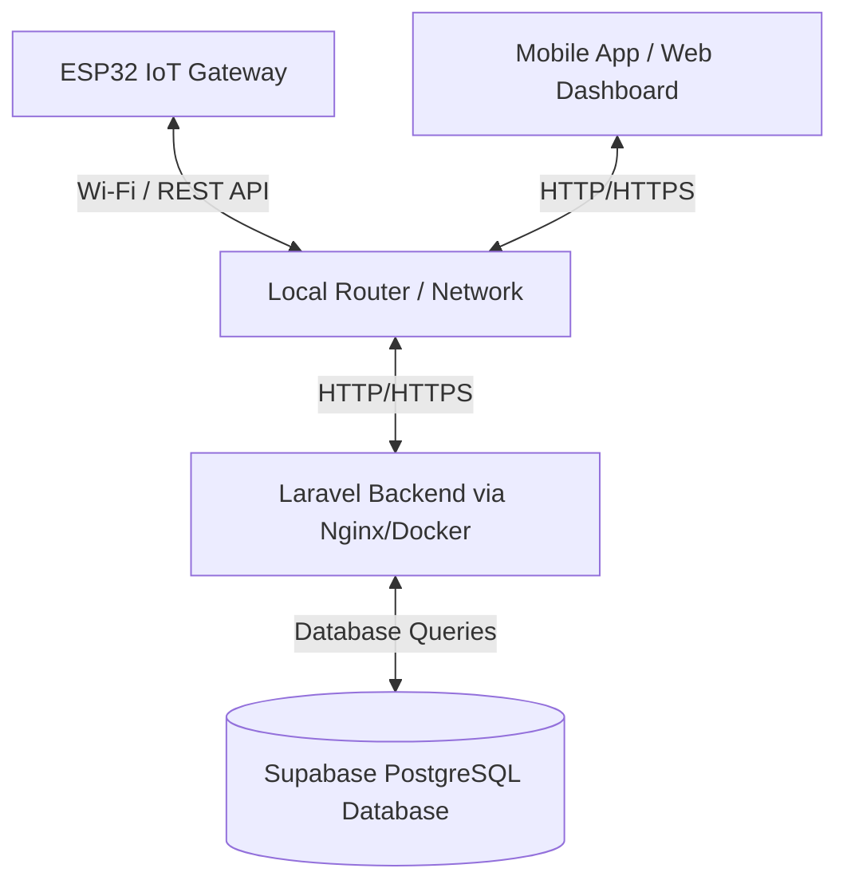
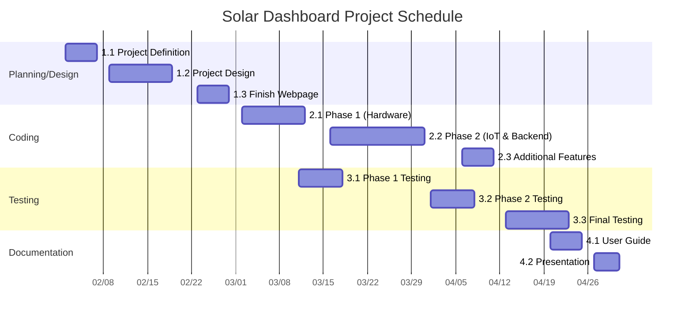
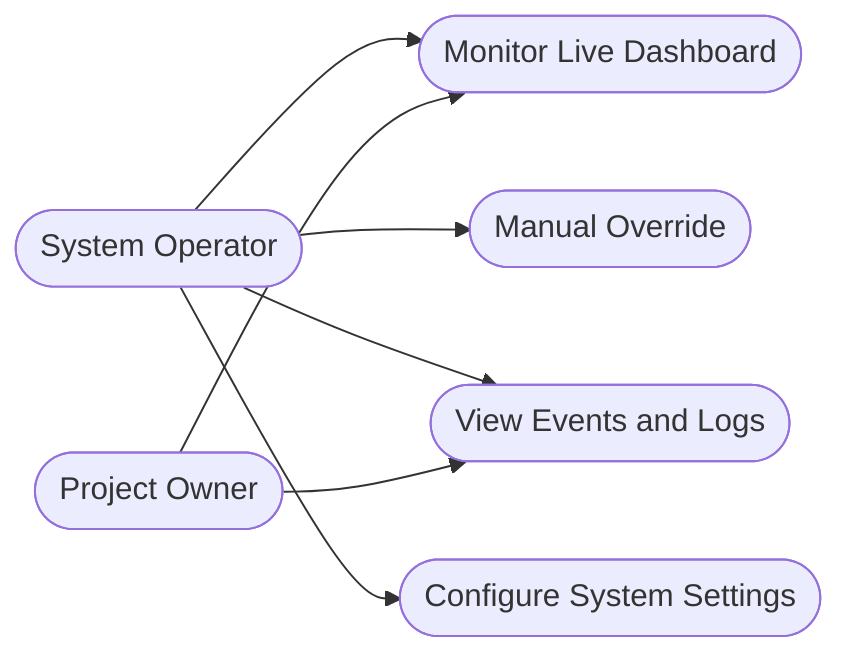

# Project Plan: Autonomous Solar Tracking Station

## I. Objectives
The Autonomous Solar Tracking Station is designed to maximize solar energy efficiency by dynamically orienting solar panels toward the sun using dual-axis motor control. The project integrates a Laravel-based web dashboard for data analytics and a React Native Android application for real-time control and monitoring.
- Provide a robust platform for tracking, logging, and managing solar station telemetry.
- Achieve accurate sun-tracking using LDR (Light Dependent Resistor) sensor arrays.
- Provide real-time battery and panel voltage monitoring.
- Enable remote manual override via a mobile application.
- Ensure data integrity during offline periods via local storage synchronization.

## II. Network Overview
The solar tracking system operates over a local wireless network, facilitating communication between the hardware edge devices and the central server. The ESP32 acts as the primary IoT gateway, connecting to the local Wi-Fi to transmit telemetry data and receive commands. A Laravel-based RESTful API backend manages incoming data, storing it in a PostgreSQL database (Supabase), and serves this data to both the React Native mobile application and web dashboard. 

## III. Network Components
### Hardware
- **ESP32 Microcontroller**: Acts as the main IoT gateway for Wi-Fi communication and logic processing.
- **Arduino Uno**: Handles low-level sensor reading and precise servo motor control.
- **LDR Sensors**: Analog sensors for measuring light intensity to calculate optimal sun orientation.
- **Servo Motors (MG996R)**: Provide physical actuation (vertical and horizontal) to adjust the solar panel position.
- **Power Supply/Battery**: Provides energy to the station and serves as a monitoring endpoint.

### Software
- **Laravel Framework**: REST API backend to process requests and serve the dashboard.
- **Supabase (PostgreSQL)**: Primary database for telemetry, logs, and system configuration.
- **React Native (Expo)**: Cross-platform framework used for the Android mobile control application.
- **Docker & Nginx**: Used for containerized deployment of the web dashboard.

## IV. Network Diagram

## V. IP Addressing Table (Optional)
*Note: IP addresses are representative and depend on the local network DHCP configuration.*

| Device / Component | IP Address / Domain | Subnet Mask | Role |
|--------------------|---------------------|-------------|------|
| Local Router / Gateway | 192.168.1.1 | 255.255.255.0 | Network routing |
| Local Server (Host) | 192.168.1.100 | 255.255.255.0 | Backend & Database host |
| ESP32 IoT Gateway | 192.168.1.150 | 255.255.255.0 | Hardware edge device |
| Mobile Device (App) | DHCP Assigned | 255.255.255.0 | Operator interface |

## VI. Server Configuration (Optional)
The backend infrastructure is hosted on a local or cloud operator machine using Docker to containerize the environment.
- **Web Server**: Nginx handling reverse proxy and serving the Laravel Blade dashboard.
- **Application Server**: PHP-FPM running the Laravel application.
- **Database Server**: Supabase (PostgreSQL) hosted externally or configured via local Docker containers.
- **Storage**: SPIFFS is used on the ESP32 for local configuration and offline data caching.

## VII. Security Plan (Optional)
### 1. Firewall Rules
- Ensure ports `80` (HTTP) and `443` (HTTPS) are open for API communication.
- Ensure the database port (e.g., `5432` for PostgreSQL) is restricted to backend server access only.
- Deny external WAN access to the ESP32 directly; all traffic must route through the Laravel API.

### 2. Security Measures (Optional)
- **Wi-Fi Security**: WPA2-PSK encryption for the local network.
- **API Authentication**: Endpoint protection using API tokens to ensure only authorized applications (ESP32, Mobile App) can submit or request telemetry.
- **Data Validation**: Server-side validation of all sensor data to prevent malformed injections.

## VIII. Schedule

| Phase | Task | Start Date | Duration | End Date |
| --- | --- | --- | --- | --- |
| **1. Planning/Design** | 1.1 Project Definition | Feb 02, 2026 | 5 days | Feb 06, 2026 |
| | 1.2 Project Design | Feb 09, 2026 | 10 days | Feb 20, 2026 |
| | 1.3 Finish Webpage | Feb 23, 2026 | 5 days | Feb 27, 2026 |
| **2. Coding** | 2.1 Phase 1 (Hardware) | Mar 02, 2026 | 10 days | Mar 13, 2026 |
| | 2.2 Phase 2 (IoT & Backend) | Mar 16, 2026 | 15 days | Apr 03, 2026 |
| | 2.3 Additional Features | Apr 06, 2026 | 5 days | Apr 10, 2026 |
| **3. Testing** | 3.1 Phase 1 Testing | Mar 11, 2026 | 7 days | Mar 19, 2026 |
| | 3.2 Phase 2 Testing | Apr 01, 2026 | 7 days | Apr 09, 2026 |
| | 3.3 Final Testing | Apr 13, 2026 | 10 days | Apr 24, 2026 |
| **4. Documentation** | 4.1 User Guide | Apr 20, 2026 | 5 days | Apr 24, 2026 |
| | 4.2 Presentation | Apr 27, 2026 | 4 days | Apr 30, 2026 |

### Gantt Chart

## IX. Use Case Diagram
### Actors
- **Project Owner**: Monitors overall station health and accesses detailed analytical logs.
- **System Users / Operators**: Actively uses the mobile app and dashboard to manage the station.

### Use Cases
- **Monitor Live Dashboard**: View real-time battery, panel voltages, and light intensity.
- **Manual Override (Solar Controller)**: Use the DPAD and precision tilt/pan controls to adjust the solar panel manually.
- **View Events and Logs**: Check system activities, sensor logs, and categorization of event types.
- **Configure System Settings**: Modify fine-grained calibration of the solar station's thresholds.

#### Human Interface Design Prototypes
- **Live Dashboard Interface**
  
- **Solar Controller Interface**
  
- **Events and Logs Interface**
  
- **System Settings Interface**
  
- **Sensor Log Interface**
  

## X. Budgetary Management Plan
*(Note: No formal budget was provided as this is an internal R&D project; estimates below reflect typical component costs)*
### A. Hardware Cost Estimate
- ESP32 Development Board: ~$5.00
- Arduino Uno: ~$10.00
- LDR Sensor Arrays: ~$5.00
- MG996R Servo Motors (x2): ~$15.00
- Power Supply / Battery Units: ~$30.00
- Miscellaneous (Wires, Breadboards, Mounts): ~$15.00
- **Total Estimated Hardware Cost**: ~$80.00

### B. Software Cost Estimate
- Laravel Framework: Open Source ($0)
- React Native / Expo: Open Source ($0)
- Supabase (PostgreSQL): Free Tier ($0)
- IDE / Tooling (VS Code, Arduino IDE): Free ($0)
- **Total Estimated Software Cost**: $0.00

### C. Miscellaneous Costs
- Testing, Cloud Hosting adjustments (if moved off local): TBD

## XI. Project Staffing (Development Phase)
### A. Project Developer
The project is currently managed by a core development team handling full-stack implementation from hardware to UI. Core roles include: Project Manager, Firmware Engineer, Backend Developer, Mobile Developer, and Software Tester.

### B. Roles Performed by the Developer
- **Project Manager**: Strategy, documentation, monitoring product backlog, and user acceptance sign-off.
- **Firmware Engineer**: ESP32 and Arduino firmware development, sensor integration, and motor logic.
- **Backend Developer**: Laravel REST API development, database architecture, and server management.
- **Mobile Developer**: React Native Android application development and UI/UX design.
- **Software Tester**: Quality assurance, hardware validation, and test case script execution.

## XII. Conclusion
The Autonomous Solar Tracking Station project represents a comprehensive integration of hardware engineering, IoT communication, and modern web and mobile application development. By adhering to this Project Plan, the development team establishes a clear roadmap from initial design to final testing within the designated timeframe (February to April 2026). The scheduled milestones ensure that both the physical hardware and the digital infrastructure are developed in tandem, ultimately delivering a reliable, efficient, and user-friendly platform for sustainable energy management and autonomous solar tracking.
