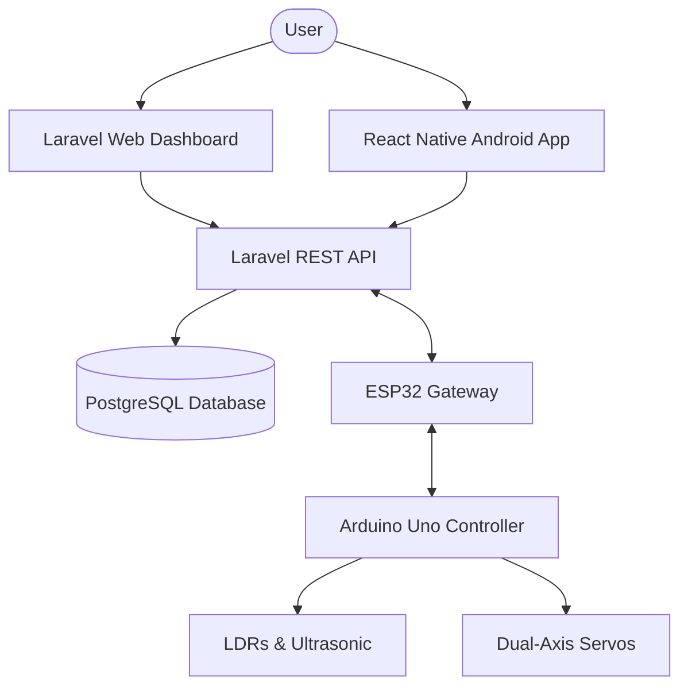
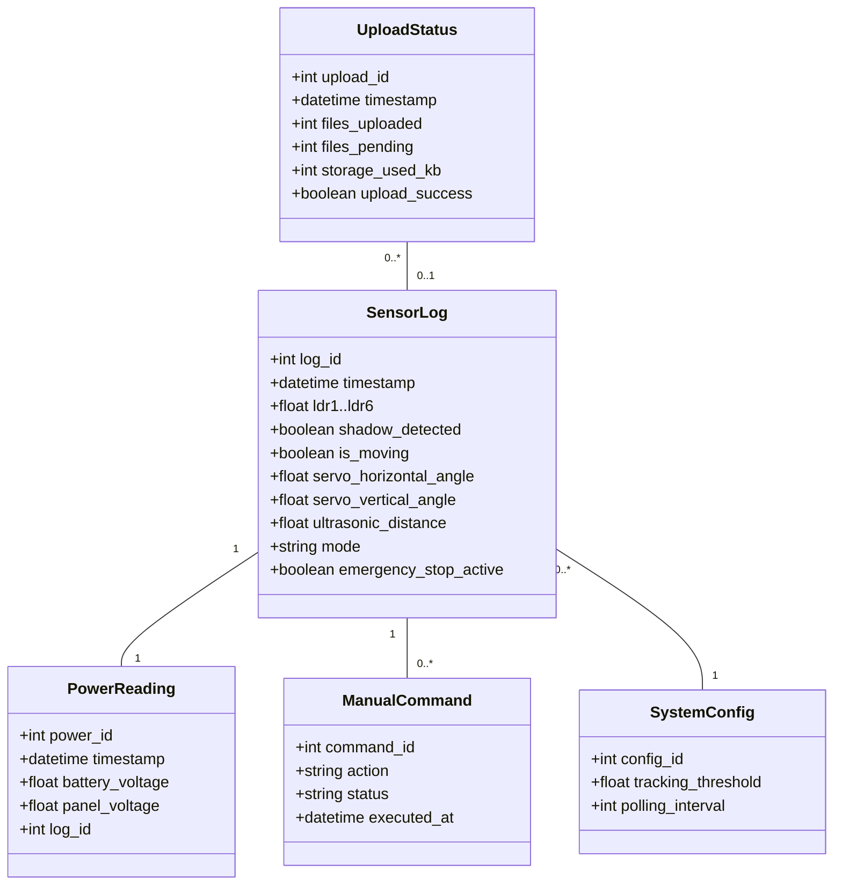
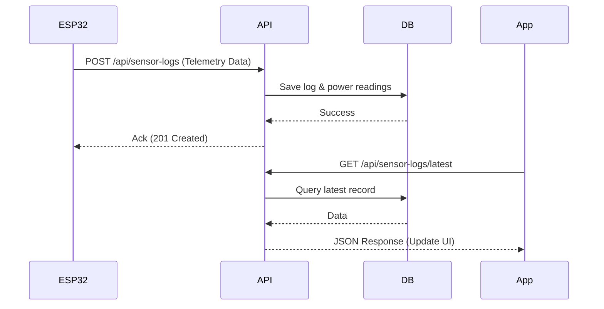
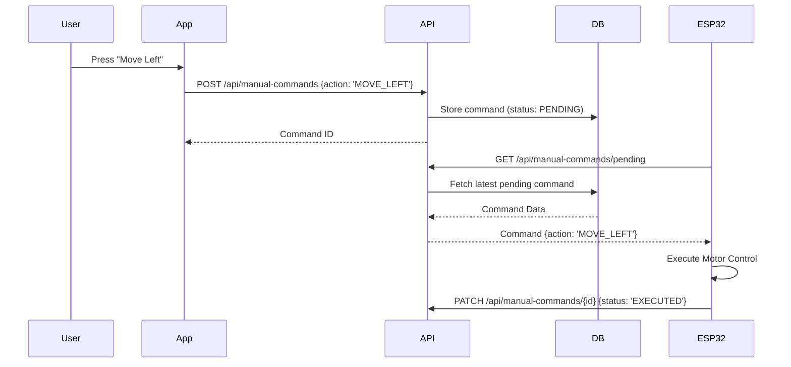

# Software Design Description (SDD)
## for Autonomous Solar Tracking Station

### 1. Introduction
#### 1.1 Purpose
This document presents the software design description for the Autonomous Solar Tracking Station project. It outlines the architectural, data, and interface designs for the web dashboard, mobile application, and integrated hardware components.

#### 1.2 Scope
The system provides real-time monitoring and remote control for a dual-axis solar tracking station. The scope includes:
- **Web Dashboard (Laravel):** For historical data analysis and system management.
- **Android Application (React Native):** For on-site/remote manual control and event monitoring.
- **Hardware Integration (ESP32/Arduino):** Telemetry acquisition and motor control.
- **Data Synchronization:** Reliable polling and manual command execution.

### 2. References
- **Laravel Framework:** PHP-based backend for API and data management.
- **React Native / Expo:** Javascript-based Android application platform.
- **PostgreSQL / Supabase:** Relational database for persistent storage.
- **Arduino/ESP32:** Firmware for sensor integration and IoT connectivity.

### 3. System Architecture
#### 3.1 Component Architecture

#### 3.2 Logical Design (Models)

### 4. Data Design
#### 4.1 Data Description
The system utilizes several key tables to manage telemetry and configuration, precisely mapped to the Supabase schema.

**Table: sensor_logs**
| Fieldname | Data Type | Description |
|-----------|-----------|-------------|
| log_id | int8 (PK) | Unique identifier for the log entry |
| timestamp | timestamp | Time of the measurement |
| config_id | int8 (FK) | Reference to active system configuration |
| ldr1..ldr6 | int2 | Light intensity readings (0-4095) |
| shadow_detected | bool | Indicates if a shadow is cast on the panel |
| is_moving | bool | Indicates motor status |
| servo_horizontal_angle | int2 | Current horizontal servo position |
| servo_vertical_angle | int2 | Current vertical servo position |
| ultrasonic_distance | float4 | Distance measured by ultrasonic sensor |
| ultrasonic_servo_angle | int2 | Angle of the ultrasonic mounting servo |
| mode | varchar | System mode ('AUTO', 'MANUAL', 'IDLE') |
| emergency_stop_active | bool | Safety stop status |

**Table: power_readings**
| Fieldname | Data Type | Description |
|-----------|-----------|-------------|
| power_id | int8 (PK) | Unique identifier |
| timestamp | timestamp | Time of measurement |
| battery_voltage | float4 | Battery charge level |
| panel_voltage | float4 | Panel generation voltage |
| log_id | int8 (FK) | Reference to parent sensor log |

**Table: manual_commands**
| Fieldname | Data Type | Description |
|-----------|-----------|-------------|
| cmd_id | int8 (PK) | Unique command identifier |
| timestamp | timestamp | Time command was issued |
| command | varchar | Action string (e.g., 'MOVE_LEFT') |
| source | varchar | Origin (e.g., 'MOBILE', 'WEB') |
| related_log_id | int8 (FK) | Context log during command |

**Table: system_configs**
| Fieldname | Data Type | Description |
|-----------|-----------|-------------|
| config_id | int8 (PK) | Primary key |
| shadow_threshold | int4 | Lux level to detect shade |
| servo_home_horizontal | int2 | Default home angle for horizontal servo |
| servo_home_vertical | int2 | Default home angle for vertical servo |
| upload_interval_sec | int4 | Telemetry sync frequency |
| motor_speed | int2 | Speed setting for servos/motors |

**Table: system_events**
| Fieldname | Data Type | Description |
|-----------|-----------|-------------|
| event_id | int8 (PK) | Primary key |
| timestamp | timestamp | Time of event occurrence |
| event_type | varchar | Category (ERROR, WARN, INFO) |
| details | text | Detailed event description |
| trigger_log_id | int8 (FK) | Reference to triggering log entry |

**Table: upload_statuses**
| Fieldname | Data Type | Description |
|-----------|-----------|-------------|
| upload_id | int8 (PK) | Primary key |
| timestamp | timestamp | Time of the upload attempt |
| files_uploaded | int4 | Count of files successfully synced |
| files_pending | int4 | Count of files remaining in queue |
| storage_used_kb| int4 | Current usage of local storage |
| upload_success | bool | Indicates if the sync session succeeded |

### 5. Detailed Design
#### 5.1 Telemetry Polling Sequence

#### 5.2 Manual Command Flow

### 6. Human Interface Design
#### 6.1 Web Dashboard (Laravel)
- **Overview:** Real-time gauges for Battery and Panel voltage.
- **Charts:** Historical trends for light intensity and power efficiency.
- **System Events:** Table showing recent errors or mode changes.

#### 6.2 Android Application (React Native)
- **Dashboard Screen:** Summary of latest readings and system status.
- **Control Screen:** Interactive joystick/buttons for manual servo adjustment.
- **Events Screen:** Notification log for system alerts.
- **Settings Screen:** Configuration for polling intervals and calibration offsets.

### 7. Database Relationship Analysis
#### 7.1 Table Relationships Overview
The database schema follows a hub-and-spoke model centered around the `sensor_logs` table:
- **sensor_logs & power_readings (1:1):** Every sensor measurement is accompanied by a precise power reading. These are separated to keep telemetry (environment) and power metrics (hardware health) modular.
- **sensor_logs & system_configs (N:1):** Multiple log entries reference a single configuration ID. This allows the system to track which thresholds and home positions were active during any specific measurement.
- **sensor_logs & manual_commands (1:N):** Commands issued via the mobile app are linked to a "related log" to provide historical context on the station's state at the moment the command was executed.
- **sensor_logs & system_events (1:N):** Events (like errors or mode changes) are linked to the log entry that triggered them, enabling precise debugging of system failures.

#### 7.2 Independence of upload_statuses
The `upload_statuses` table intentionally lacks direct foreign key relationships with the telemetry tables for the following reasons:
- **System Health Monitoring:** This table serves as a "meta-monitoring" layer. It tracks the health of the synchronization process itself (e.g., SPIFFS usage on the ESP32, number of files in the queue) rather than the specific content of the data being moved.
- **Asynchronous Synchronization:** Telemetry uploads may happen in batches (especially after offline periods). Linking a single upload status to thousands of sensor logs would create unnecessary overhead and database locking.
- **Modular Architecture:** By keeping upload metrics independent, the system can monitor the efficiency of the "data pipe" without being tightly coupled to the structure of the "data" itself. This allows for easier updates to the telemetry schema without affecting the sync monitoring logic.
