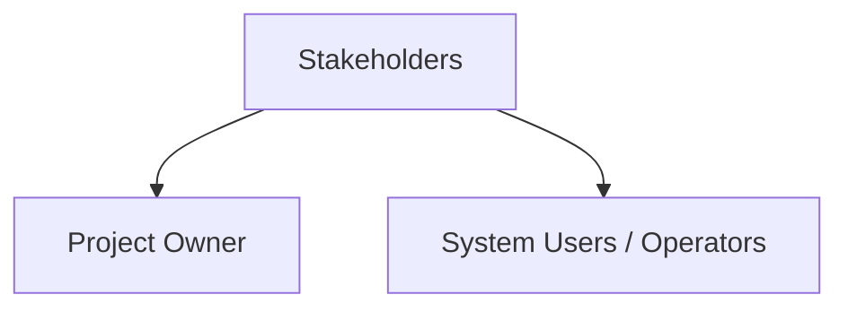
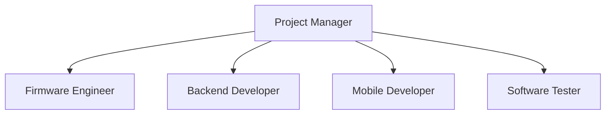
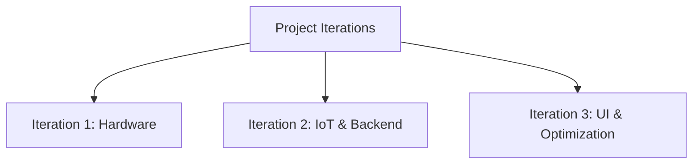

# Software Project Management Plan

for

**Autonomous Solar Tracking Station**

---

## List of Figures
| Figure No. | Description |
|------------|-------------|
| Figure 1.0 | External Structure |
| Figure 2.0 | Internal Structure |
| Figure 3.0 | Feature Breakdown Structure |
| Figure 4.0 | Live Dashboard Interface |
| Figure 5.0 | Solar Controller Interface |
| Figure 6.0 | Events and Logs Interface |
| Figure 7.0 | System Settings Interface |
| Figure 8.0 | Sensor Log Interface |

## List of Tables
| Table No. | Description |
|-----------|-------------|
| Table 1.0 | Milestone Task |
| Table 2.0 | Definition, Acronyms, and Abbreviations |
| Table 3.0 | Roles and Responsibilities |
| Table 4.0 | Staff and Person Involved in Project |
| Table 5.0 | Work Plan |
| Table 6.0 | Work Activities |
| Table 7.0 | Methods and Techniques |
| Table 8.0 | Tools |

---

## 1. Overview

### 1.1. Project Summary

#### 1.1.1. Purpose, Scope and Objectives
The **Autonomous Solar Tracking Station** is designed to maximize solar energy efficiency by dynamically orienting solar panels toward the sun using dual-axis motor control. The project integrates a Laravel-based web dashboard for data analytics and a React Native Android application for real-time control and monitoring.
- **Purpose:** To provide a robust platform for tracking, logging, and managing solar station telemetry.
- **Scope:** Includes firmware for ESP32/Arduino, a RESTful API backend, a PostgreSQL database (Supabase), and Android mobile and web interfaces.
- **Objectives:**
    - Achieve accurate sun-tracking using LDR sensor arrays.
    - Provide real-time battery and panel voltage monitoring.
    - Enable remote manual override via mobile app.
    - Ensure data integrity during offline periods via local storage synchronization.

#### 1.1.2. Assumptions and Constraints
- **Technologies:** Laravel (Backend), React Native/Expo (Mobile), Supabase (DB), C++/Arduino (Firmware).
- **Deployment:** Web dashboard hosted via Docker/Nginx; Android application deployed via Expo.
- **Hardware:** ESP32 as the IoT gateway; Arduino Uno for low-level sensor/motor processing.
- **Coding Pattern:** Repository-Service (Backend); Hub-and-Spoke (Data); Gateway-Controller (Firmware).
- **Connectivity Constraints:** Bluetooth range is 10–30m. All components require local network access.
- **Hardware Limitations:** Servo motors are constrained to physical ranges (10°–90° vertical) to prevent strain. Emergency Stop is triggered if battery voltage drops below 11.0V.

#### 1.1.3. Project Deliverables
All of the items listed in this subsection are the deliverables that are to be provided prior to completion of the project:
- Software Program (Autonomous Solar Tracking Station Dashboard & Mobile App)
- Firmware Codebase (Arduino & ESP32)
- Software Documentation
  - Software Requirements Specification (SRS)
  - Software Design Description (SDD)
  - Software Project Management Plan (SPMP)
  - Software Test Document (STD)
- Installation of software program on target hardware

#### 1.1.4. Schedule and Budget Summary
This is the schedule summary of the project. No formal budget was provided as this is an internal research and development project.

| Milestone Task | Date Started | Completion Date |
|----------------|--------------|-----------------|
| Project Proposal | April 2026 | April 2026 |
| Hardware Integration Phase | May 2026 | May 2026 |
| IoT Connectivity Phase | June 2026 | June 2026 |
| Backend Development Phase | July 2026 | July 2026 |
| Mobile/Web UI Phase | August 2026 | August 2026 |
| System Optimization Phase | September 2026 | September 2026 |

*Table 1.0 Milestone Task*

### 1.2. Evolution of plan
All changes to the project management plan must be agreed to by the project manager before they are implemented. All changes should be documented in order to keep the project management plan correct and up to date.

### 1.3. Definition, Acronyms, and Abbreviations

| Term | Definition |
|------|------------|
| ESP32 | Espressif Systems Wi-Fi/Bluetooth microcontroller used as the IoT gateway |
| Arduino | Microcontroller board for low-level sensor reading and motor control |
| LDR | Light Dependent Resistor — analog sensor for measuring light intensity |
| SPIFFS | SPI Flash File System — local storage on the ESP32 |
| API | Application Programming Interface |

*Table 2.0 Definition, Acronyms, and Abbreviations*

---

## 2. References
- Software Requirements Specification (SRS) for Autonomous Solar Tracking Station
- Software Design Description (SDD) for Autonomous Solar Tracking Station
- Laravel Framework Documentation
- React Native / Expo Documentation
- Arduino C++ Reference Guide

---

## 3. Project Organization

### 3.1. External Structure
The project serves renewable energy stakeholders and independent solar power operators. The organizational chart of the external structure is represented below (Figure 1.0).

*Figure 1.0 External Structure*

### 3.2. Internal Structure
The project is currently managed by a core development team responsible for hardware, backend, and frontend implementations.

*Figure 2.0 Internal Structure*

### 3.3. Roles and Responsibilities

| Role | Responsibilities |
|------|------------------|
| Project Manager | Strategy, documentation, monitoring product backlog, and user acceptance sign-off. |
| Firmware Engineer | ESP32 and Arduino firmware development, sensor integration, and motor logic. |
| Backend Developer | Laravel REST API development, database architecture, and server management. |
| Mobile Developer | React Native Android application development and UI/UX design. |
| Software Tester | Quality assurance, hardware validation, and test case script execution. |

*Table 3.0 Roles and Responsibilities*

---

## 4. Managerial Process Plans

### 4.1. Start-up plan

#### 4.1.1. Estimation Plan
The project follows an Agile/Iterative approach since hardware and software integration requires continuous refinement. Each iteration focuses on one layer of the stack (Hardware -> API -> UI).

*Figure 3.0 Feature Breakdown Structure*

#### 4.1.2. Staffing Plan

| Name | Position | Status |
|------|----------|--------|
| Staff Member 1 | Project Manager | Full Time |
| Staff Member 2 | Firmware Engineer | Full Time |
| Staff Member 3 | Backend Developer | Full Time |
| Staff Member 4 | Mobile Developer | Full Time |
| Staff Member 5 | Software Tester | Full Time |

*Table 4.0 Staff and Person Involved in Project*

#### 4.1.3. Resource Acquisition Plan
All necessary hardware (ESP32, Arduino Uno, Servos, LDRs) and software tools for the project are already acquired. The project team will gather necessary threshold data from physical calibration tests.

#### 4.1.4. Project Staff Training Plan
No specialized training is required, as the core development team is already well-versed in Laravel, React Native, and Arduino C++.

### 4.2. Work plan

| Project Task | Estimated Schedule |
|--------------|--------------------|
| **1 Iteration 1 (Hardware)** | |
| 1.1 Sensor Integration | May 1 - May 7 |
| 1.2 Servo Motor Logic | May 8 - May 15 |
| **2 Iteration 2 (IoT & Backend)** | |
| 2.1 ESP32 WiFi Communication | June 1 - June 10 |
| 2.2 Laravel API Development | June 11 - June 20 |
| **3 Iteration 3 (UI & Optimization)** | |
| 3.1 Dashboard Interfaces | July 1 - July 15 |
| 3.2 System Optimization | August 1 - August 15 |

*Table 5.0 Work Plan*

#### 4.2.1. Work activities

| Project Task | Role | Labor Hours |
|--------------|------|-------------|
| **Iteration 1** | | |
| Sensor Integration | Firmware Engineer | 30 |
| Motor Logic Testing | Software Tester | 10 |
| **Iteration 2** | | |
| API Development | Backend Developer | 30 |
| ESP32 IoT Comm | Firmware Engineer | 20 |
| Backend Integration | Software Tester | 15 |
| **Iteration 3** | | |
| Dashboard Interfaces| Mobile Developer | 40 |
| System Optimization | Backend Developer | 15 |

*Table 6.0 Work Activities*

#### 4.2.2. Schedule Allocation
The project duration is constrained to three different iterations. Schedule presented may change depending on hardware calibration modifications.

#### 4.2.3. Resource Allocation
The development team is allocated dedicated hours per iteration to comply with the requirements and tasks assigned.

#### 4.2.4. Budget Allocation
No budget was funded by stakeholders during the development phase. Thus, no necessary plan is needed for allocating budget.

### 4.3. Control plan

#### 4.3.1. Requirements Control Plan
Requirements will be managed in the use case descriptions of the SRS as requirements are changed.

#### 4.3.2. Schedule Control Plan
The development team conducts regular retrospectives to monitor daily progress, impediments, and tasks to accomplish.

#### 4.3.3. Budget Control Plan
As stated under section 4.2.4, no budget control plan is provided.

#### 4.3.4. Quality Control Plan
The tester will generate a separate Software Testing Document (STD). Unit testing and hardware validation will be the main mechanisms to control product quality.

#### 4.3.5. Reporting Plan
The team will submit a status report to the stakeholders at the end of each iteration.

#### 4.3.6. Metrics Collection Plan
Metrics such as telemetry upload success rates and tracking accuracy are collected during the System Optimization phase.

#### 4.3.7. Risk Management Plan
Risks (e.g., servo mechanical strain, network disconnections) will be identified and mitigated during regular review sessions.

#### 4.3.8. Project Closeout Plan
The development team will ensure proper closeout and hand-off of the station to the operators upon final acceptance.

---

## 5. Technical Process Plans

### 5.1. Process Model
An Agile Scrum model is used, with regular retrospectives on hardware performance and UI usability.

### 5.2. Methods, Tools, and Techniques

| Category | Methods and Techniques |
|----------|------------------------|
| Requirements Elicitation | Physical prototyping, informal interviews. |
| Formal Specification | UML and Mermaid diagrams. |
| Interface Prototyping | UI Mockups (See Human Interface Design below). |

*Table 7.0 Methods and Techniques*

| Category | Tools |
|----------|-------|
| Operating System | Windows (WSL / Ubuntu) |
| Programming Language | PHP, Javascript, C++ |
| Database | Supabase (PostgreSQL) |
| Front-end Design | Laravel Blade, React Native (Expo) |
| Hardware Equipment | ESP32, Arduino Uno, MG996R Servos |

*Table 8.0 Tools*

#### Human Interface Design Prototypes

**Live Dashboard Interface**
The Live Dashboard provides a real-time overview of the station's performance metrics including battery, panel voltages, and light intensity.

*Figure 4.0 Live Dashboard Interface*

**Solar Controller Interface**
The Solar Controller serves as the manual override module with a DPAD and precision tilt/pan controls.

*Figure 5.0 Solar Controller Interface*

**Events and Logs Interface**
Records all system activities, categorized by event type.

*Figure 6.0 Events and Logs Interface*

**System Settings Interface**
Allows fine-grained calibration of the solar station's thresholds.

*Figure 7.0 System Settings Interface*

**Sensor Log Interface**
Tabular view detailing precise timestamps, light intensity values, and angles.

*Figure 8.0 Sensor Log Interface*

### 5.3. Infrastructure Plan
The backend is hosted using Docker and Nginx on the operator's machine. The mobile application is distributed via Expo Go.

### 5.4. Product Acceptance Plan
The project owner will evaluate the system based on the test cases defined in the Software Test Document (STD). Sign-off will serve as proof of final acceptance.

---

## 6. Supporting Process Plans

### 6.1. Verification and Validation Plan
The development team has created a separate Software Testing Document (STD) for verification and validation.

### 6.2. Documentation Plan
There are a number of documents that will be produced during the lifetime of the project, maintained under version control:
- Software Project Management Plan (SPMP)
- Software Requirements Specification (SRS)
- Software Design Description (SDD)
- Software Test Document (STD)

### 6.3. Quality Assurance Plan
Continuous monitoring of `system_events` and `upload_statuses` tables to identify firmware crashes or synchronization failures. Problems found shall be fixed.

### 6.4. Problem Resolution Plan
Major issues faced by the development team (e.g. offline syncing issues) are tracked via system events and discussed during retrospectives. Decisions are finalized by the Project Manager.