# Software Requirements Specification (SRS)
## for Autonomous Solar Tracking Station

**Document Version:** 1.0
**Date:** May 1, 2026
**Project:** Autonomous Solar Tracking Station — Monitoring & Control Platform

---

### 1. Introduction

#### 1.1 Purpose
This Software Requirements Specification (SRS) document describes the functional and non-functional requirements for the **Autonomous Solar Tracking Station** system. It is intended to serve as a comprehensive reference for the development team, project stakeholders, and quality assurance personnel throughout the software development lifecycle. This document follows the IEEE 830 standard for software requirements specifications.

#### 1.2 Scope
The Autonomous Solar Tracking Station is an integrated IoT platform designed to maximize solar energy harvesting efficiency through dual-axis motor-driven panel orientation. The system encompasses:

- **ESP32/Arduino Firmware (C++):** Sensor data acquisition, motor control logic, and IoT gateway communication.
- **Laravel Web Dashboard (PHP):** Server-side API, real-time telemetry visualization, historical data analysis, and system event monitoring.
- **React Native Android Application (JavaScript):** On-site and remote manual control, live dashboard monitoring, and system configuration management.
- **PostgreSQL Database (Supabase):** Persistent cloud storage for telemetry, power readings, commands, events, and configuration data.

The software does **not** include:
- Solar panel hardware fabrication or electrical wiring design.
- Third-party weather service integrations.
- Multi-user authentication or role-based access control (single-operator system).

#### 1.3 Definitions, Acronyms, and Abbreviations

| Term | Definition |
|------|-----------|
| **LDR** | Light Dependent Resistor — analog sensor for measuring light intensity |
| **ESP32** | Espressif Systems Wi-Fi/Bluetooth microcontroller used as the IoT gateway |
| **Arduino Uno** | Microcontroller board for low-level sensor reading and motor control |
| **Servo** | MG996R positional motor used for dual-axis panel orientation |
| **Telemetry** | Sensor measurements transmitted from the station to the server |
| **SPIFFS** | SPI Flash File System — local storage on the ESP32 for offline data buffering |
| **API** | Application Programming Interface — RESTful HTTP endpoints |
| **DPAD** | Directional Pad — UI control element for manual motor movement |
| **Supabase** | Cloud-hosted PostgreSQL database service |
| **OLED** | Organic Light-Emitting Diode — local display on the station hardware |
| **BLE** | Bluetooth Low Energy — short-range wireless protocol for manual control |

#### 1.4 References
- Software Design Description (SDD) for Autonomous Solar Tracking Station, v1.0
- Software Project Management Plan (SPMP) for Autonomous Solar Tracking Station, v1.0
- Laravel 11 Framework Documentation
- React Native / Expo SDK Documentation
- Arduino ESP32 Core Library Documentation
- IEEE 830-1998 — Recommended Practice for Software Requirements Specifications

#### 1.5 Overview
The remainder of this document is organized as follows:
- **Section 2** provides a general description of the product, its context, constraints, and user characteristics.
- **Section 3** specifies the detailed functional requirements (including use cases), and non-functional requirements.
- **Section 4** defines the system's external interface requirements.
- **Section 5** describes the data requirements and database specifications.
- **Section 6** outlines the system modes of operation.
- **Section 7** contains appendices including API summary, hardware list, and traceability matrix.

---

### 2. General Description

#### 2.1 Product Perspective
The Autonomous Solar Tracking Station operates as a self-contained IoT ecosystem. It is composed of four interconnected subsystems:

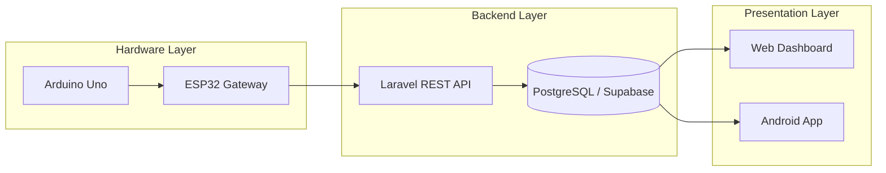
```mermaid
graph LR
    subgraph Hardware Layer
        A[Arduino Uno] --> B[ESP32 Gateway]
    end
    subgraph Backend Layer
        B --> C[Laravel REST API]
        C --> D[(PostgreSQL / Supabase)]
    end
    subgraph Presentation Layer
        D --> E[Web Dashboard]
        D --> F[Android App]
    end
```

- **Hardware Layer:** The Arduino Uno reads sensor data (6× LDRs, 1× ultrasonic, voltage dividers) and drives servo motors. The ESP32 acts as the Wi-Fi/Bluetooth gateway, forwarding telemetry to the API and receiving configuration/commands.
- **Backend Layer:** A Laravel application exposes RESTful API endpoints for data ingestion, retrieval, and configuration management. Data is persisted in a Supabase-hosted PostgreSQL database.
- **Presentation Layer:** A server-rendered Laravel Blade web dashboard and a React Native Android application provide visualization and control interfaces.

#### 2.2 Product Functions
The system provides the following high-level functions:

1. **Autonomous Solar Tracking** — Automatically orient solar panels toward the highest light intensity using a 6-sensor LDR array and dual-axis servo motors.
2. **Real-Time Telemetry Monitoring** — Display live sensor readings (light, voltage, angles, distance) on both web and mobile interfaces.
3. **Historical Data Analysis** — Visualize trends in light intensity, power generation, and servo positions over configurable time ranges.
4. **Manual Override Control** — Allow the operator to manually adjust panel orientation via mobile app (Bluetooth/API) with directional pad and precision controls.
5. **Obstacle Detection & Avoidance** — Use ultrasonic sensor scanning to detect physical obstructions and execute evasion sequences.
6. **Emergency Stop** — Provide a software-triggered emergency halt of all motor activity for safety.
7. **Remote Configuration** — Enable adjustment of tracking thresholds, servo home positions, motor speed, and polling intervals from the mobile application.
8. **Offline Data Buffering** — Queue telemetry data locally on the ESP32 (SPIFFS) when the network is unavailable and synchronize upon reconnection.
9. **System Event Logging** — Record and categorize system events (errors, warnings, mode changes) for auditing and troubleshooting.
10. **Upload Status Monitoring** — Track the health and progress of data synchronization between the station and the cloud.

#### 2.3 User Characteristics
The system is designed for a single operator who assumes the role of both administrator and end-user:

| Characteristic | Description |
|---------------|-------------|
| **Technical Proficiency** | Moderate to advanced; familiar with IoT hardware and web/mobile interfaces |
| **Usage Context** | On-site monitoring via mobile app; remote analysis via web dashboard |
| **Primary Goal** | Maximize solar energy collection and monitor station health |
| **Interaction Frequency** | Periodic monitoring with occasional manual intervention |

#### 2.4 Constraints

1. **Hardware Constraints:**
   - Servo angular range limited to physical boundaries (e.g., 10°–90° vertical tilt) to prevent mechanical damage.
   - Ultrasonic sensor detection cone is directional; blind spots exist outside the scanning arc.
   - ESP32 has limited RAM (~320 KB) and SPIFFS storage for offline buffering.

2. **Connectivity Constraints:**
   - Bluetooth manual control range is approximately 10–30 meters.
   - All network components (Server, App, ESP32) must reside on the same local network subnet unless a VPN/WAN gateway is configured.
   - High-frequency manual commands use Bluetooth to avoid Wi-Fi/API congestion.

3. **Technology Constraints:**
   - Backend is PHP/Laravel 11; mobile is React Native with Expo; firmware is C++ (Arduino framework).
   - Database is Supabase (PostgreSQL); local development uses SQLite.

4. **Power Constraints:**
   - The system enters forced Emergency Stop if battery voltage drops below 11.0V to protect hardware.

#### 2.5 Assumptions and Dependencies
- A stable local Wi-Fi network is available at the deployment site for regular operation.
- The Supabase cloud database is accessible via the internet for persistent storage.
- The operator's Android device supports Bluetooth Low Energy for manual control.
- Docker and Nginx are available on the host machine for web dashboard deployment.
- The Arduino Uno is physically connected to the ESP32 via serial communication.

---

### 3. Specific Requirements

#### 3.1 Functional Requirements

##### 3.1.1 Telemetry Data Acquisition (Firmware)

| ID | Requirement | Priority |
|----|------------|----------|
| FR-01 | The Arduino Uno shall read analog values from six (6) LDR sensors at a configurable polling interval. | High |
| FR-02 | The Arduino Uno shall read distance measurements from the HC-SR04 ultrasonic sensor. | High |
| FR-03 | The ESP32 shall read battery voltage and panel voltage via analog voltage divider circuits. | High |
| FR-04 | The firmware shall compute an average light intensity value from all six LDR readings. | Medium |
| FR-05 | The firmware shall detect shadow conditions when any LDR reading falls below the configured `shadow_threshold`. | High |

##### 3.1.2 Autonomous Tracking (Firmware)

| ID | Requirement | Priority |
|----|------------|----------|
| FR-06 | In AUTO mode, the system shall compare LDR sensor pairs to determine the direction of highest light intensity. | High |
| FR-07 | The system shall adjust the horizontal servo angle to track the horizontal light gradient. | High |
| FR-08 | The system shall adjust the vertical servo angle to track the vertical light gradient. | High |
| FR-09 | Servo movements shall be constrained within the configured angular limits to prevent mechanical damage. | High |
| FR-10 | The system shall return servos to their configured home positions (`servo_home_horizontal`, `servo_home_vertical`) when entering IDLE mode. | Medium |

##### 3.1.3 Obstacle Detection and Avoidance (Firmware)

| ID | Requirement | Priority |
|----|------------|----------|
| FR-11 | The ultrasonic sensor shall scan within the configured arc (`ultrasonic_scan_min_angle` to `ultrasonic_scan_max_angle`). | High |
| FR-12 | When an obstacle is detected within the `obstacle_distance_threshold`, the system shall execute an avoidance sequence. | High |
| FR-13 | The system shall log an obstacle detection event to the `system_events` table via the API. | Medium |

##### 3.1.4 Manual Control

| ID | Requirement | Priority |
|----|------------|----------|
| FR-14 | The operator shall be able to switch the station between AUTO, MANUAL, and IDLE modes via the mobile application. | High |
| FR-15 | In MANUAL mode, the operator shall be able to control panel orientation using directional commands (MOVE_LEFT, MOVE_RIGHT, MOVE_UP, MOVE_DOWN). | High |
| FR-16 | An Emergency Stop button shall immediately halt all motor activity when activated. | High |
| FR-17 | Manual commands shall be recorded in the `manual_commands` table with the issuing source (MOBILE, WEB). | Medium |

##### 3.1.5 Data Transmission and Synchronization

| ID | Requirement | Priority |
|----|------------|----------|
| FR-18 | The ESP32 shall transmit telemetry data to the Laravel API via HTTP POST to `/api/sensor-logs`. | High |
| FR-19 | The ESP32 shall transmit power readings to the API via HTTP POST to `/api/power-readings`. | High |
| FR-20 | When the network is unavailable, the ESP32 shall store telemetry data locally on SPIFFS. | High |
| FR-21 | Upon network restoration, the ESP32 shall upload all buffered data and report sync status to `/api/upload-statuses`. | High |
| FR-22 | The ESP32 shall fetch the latest system configuration from `GET /api/system-configs/latest` on startup and at configurable intervals. | Medium |

##### 3.1.6 Web Dashboard

| ID | Requirement | Priority |
|----|------------|----------|
| FR-23 | The web dashboard shall display the latest sensor log data including LDR values, servo angles, mode, and movement status. | High |
| FR-24 | The dashboard shall display real-time battery voltage and panel voltage from the latest power reading. | High |
| FR-25 | The dashboard shall render interactive charts for light intensity trends, servo positions, and power metrics over selectable time ranges (15min, 30min, 1hour, 6hours, 24hours, 7days). | High |
| FR-26 | The dashboard shall display a table of recent system events categorized by type (ERROR, WARN, INFO). | Medium |
| FR-27 | The dashboard shall display the five most recent upload statuses showing sync health. | Medium |
| FR-28 | The dashboard shall provide a sensor logs history page with infinite scroll pagination. | Medium |
| FR-29 | The sensor logs page shall support filtering by date range, shadow detection status, and operational mode. | Medium |

##### 3.1.7 Mobile Application (Android)

| ID | Requirement | Priority |
|----|------------|----------|
| FR-30 | The app shall display a live dashboard screen summarizing the latest readings and system status. | High |
| FR-31 | The app shall provide a control screen with an interactive DPAD and precision tilt/pan controls. | High |
| FR-32 | The app shall provide an events and logs screen showing categorized system activity history. | Medium |
| FR-33 | The app shall provide a settings screen for configuring API endpoints, polling intervals, shadow thresholds, motor speed, and servo calibration values. | Medium |
| FR-34 | Configuration changes made in the app shall be persisted to the database via `POST /api/system-configs`. | Medium |

##### 3.1.8 API Data Management

| ID | Requirement | Priority |
|----|------------|----------|
| FR-35 | The API shall accept and store sensor log entries via `POST /api/sensor-logs`, returning the generated `log_id`. | High |
| FR-36 | The API shall accept and store power readings via `POST /api/power-readings`, linked to a parent `log_id`. | High |
| FR-37 | The API shall return the latest sensor log (with associated power reading) via `GET /api/sensor-logs/latest`. | High |
| FR-38 | The API shall return paginated sensor logs via `GET /api/sensor-logs`. | Medium |
| FR-39 | The API shall accept and store system events via `POST /api/system-events`. | Medium |
| FR-40 | The API shall return recent system events via `GET /api/system-events/recent` with a configurable limit (max 100). | Medium |
| FR-41 | The API shall accept and store manual commands via `POST /api/manual-commands`. | High |
| FR-42 | The API shall accept and store upload status records via `POST /api/upload-statuses`. | Medium |
| FR-43 | The API shall return the latest system configuration via `GET /api/system-configs/latest`. | High |
| FR-44 | The API shall accept and store new system configurations via `POST /api/system-configs`. | Medium |
| FR-45 | The API shall automatically assign the current timestamp if none is provided in POST requests. | Low |

##### 3.1.9 Use Cases

###### 3.1.9.1 Use Case Diagrams

**Figure 1.0 — Monitor Live Telemetry Use Case**
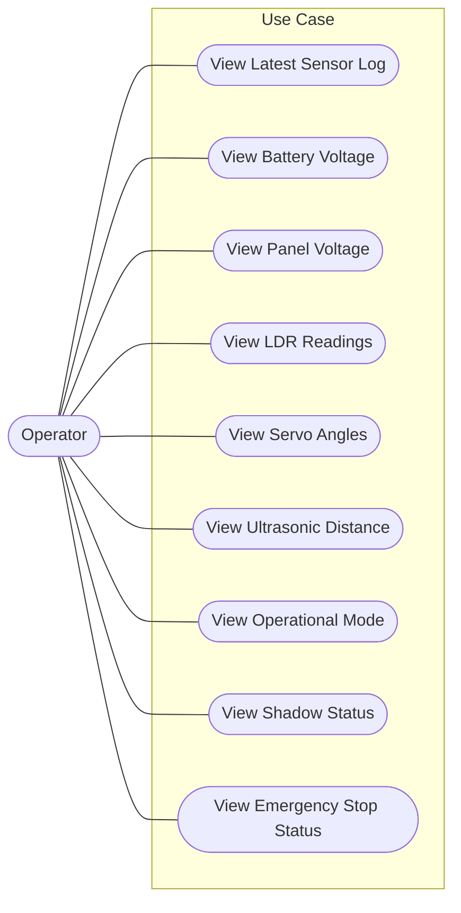
```mermaid
graph LR
    Actor1(["Operator"])

    subgraph Use Case
        direction TB
        A(["View Latest Sensor Log"])
        B(["View Battery Voltage"])
        C(["View Panel Voltage"])
        D(["View LDR Readings"])
        E(["View Servo Angles"])
        F(["View Ultrasonic Distance"])
        G(["View Operational Mode"])
        H(["View Shadow Status"])
        I(["View Emergency Stop Status"])
    end

    Actor1 --- A
    Actor1 --- B
    Actor1 --- C
    Actor1 --- D
    Actor1 --- E
    Actor1 --- F
    Actor1 --- G
    Actor1 --- H
    Actor1 --- I
```

**Figure 2.0 — Analyze Historical Data Use Case**
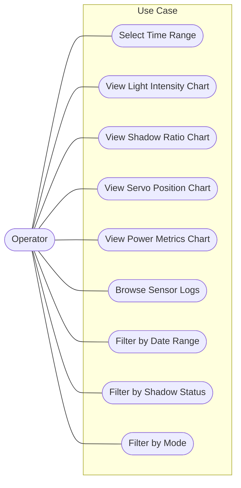
```mermaid
graph LR
    Actor1(["Operator"])

    subgraph Use Case
        direction TB
        A(["Select Time Range"])
        B(["View Light Intensity Chart"])
        C(["View Shadow Ratio Chart"])
        D(["View Servo Position Chart"])
        E(["View Power Metrics Chart"])
        F(["Browse Sensor Logs"])
        G(["Filter by Date Range"])
        H(["Filter by Shadow Status"])
        I(["Filter by Mode"])
    end

    Actor1 --- A
    Actor1 --- B
    Actor1 --- C
    Actor1 --- D
    Actor1 --- E
    Actor1 --- F
    Actor1 --- G
    Actor1 --- H
    Actor1 --- I
```

**Figure 3.0 — Manually Control Panel Orientation Use Case**
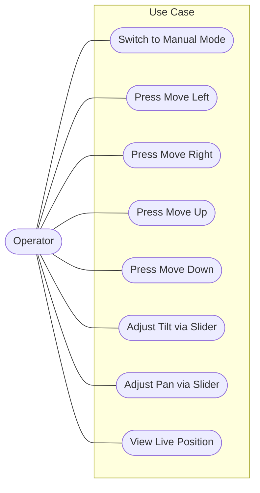
```mermaid
graph LR
    Actor1(["Operator"])

    subgraph Use Case
        direction TB
        A(["Switch to Manual Mode"])
        B(["Press Move Left"])
        C(["Press Move Right"])
        D(["Press Move Up"])
        E(["Press Move Down"])
        F(["Adjust Tilt via Slider"])
        G(["Adjust Pan via Slider"])
        H(["View Live Position"])
    end

    Actor1 --- A
    Actor1 --- B
    Actor1 --- C
    Actor1 --- D
    Actor1 --- E
    Actor1 --- F
    Actor1 --- G
    Actor1 --- H
```

**Figure 4.0 — Activate Emergency Stop Use Case**
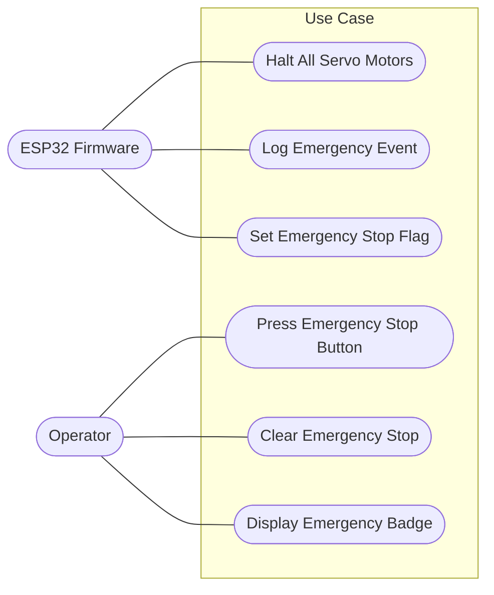
```mermaid
graph LR
    Actor1(["Operator"])
    Actor2(["ESP32 Firmware"])

    subgraph Use Case
        direction TB
        A(["Press Emergency Stop Button"])
        B(["Halt All Servo Motors"])
        C(["Log Emergency Event"])
        D(["Set Emergency Stop Flag"])
        E(["Display Emergency Badge"])
        F(["Clear Emergency Stop"])
    end

    Actor1 --- A
    Actor1 --- F
    Actor2 --- B
    Actor2 --- C
    Actor2 --- D
    Actor1 --- E
```

**Figure 5.0 — Configure System Parameters Use Case**
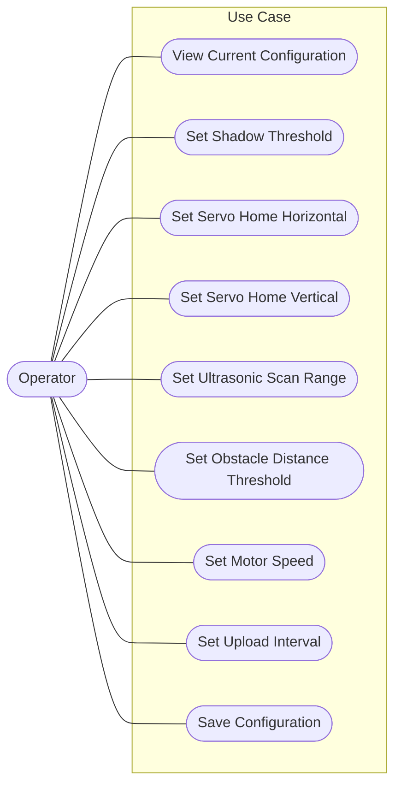
```mermaid
graph LR
    Actor1(["Operator"])

    subgraph Use Case
        direction TB
        A(["View Current Configuration"])
        B(["Set Shadow Threshold"])
        C(["Set Servo Home Horizontal"])
        D(["Set Servo Home Vertical"])
        E(["Set Ultrasonic Scan Range"])
        F(["Set Obstacle Distance Threshold"])
        G(["Set Motor Speed"])
        H(["Set Upload Interval"])
        I(["Save Configuration"])
    end

    Actor1 --- A
    Actor1 --- B
    Actor1 --- C
    Actor1 --- D
    Actor1 --- E
    Actor1 --- F
    Actor1 --- G
    Actor1 --- H
    Actor1 --- I
```

**Figure 6.0 — Perform Autonomous Solar Tracking Use Case**
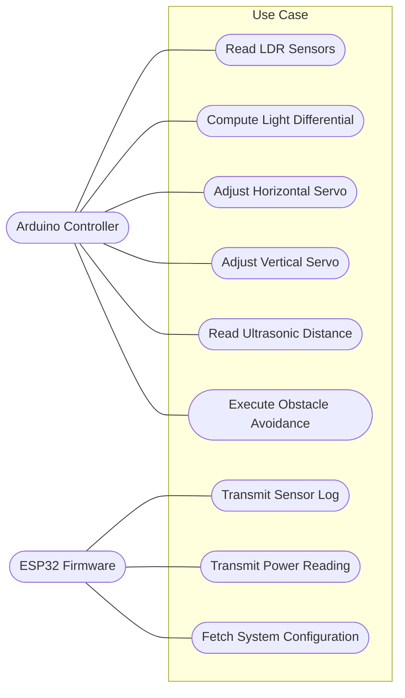
```mermaid
graph LR
    Actor1(["ESP32 Firmware"])
    Actor2(["Arduino Controller"])

    subgraph Use Case
        direction TB
        A(["Read LDR Sensors"])
        B(["Compute Light Differential"])
        C(["Adjust Horizontal Servo"])
        D(["Adjust Vertical Servo"])
        E(["Read Ultrasonic Distance"])
        F(["Execute Obstacle Avoidance"])
        G(["Transmit Sensor Log"])
        H(["Transmit Power Reading"])
        I(["Fetch System Configuration"])
    end

    Actor2 --- A
    Actor2 --- B
    Actor2 --- C
    Actor2 --- D
    Actor2 --- E
    Actor2 --- F
    Actor1 --- G
    Actor1 --- H
    Actor1 --- I
```

**Figure 7.0 — Synchronize Offline Data Use Case**
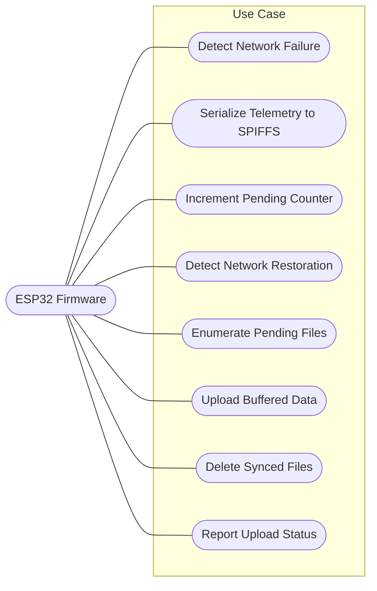
```mermaid
graph LR
    Actor1(["ESP32 Firmware"])

    subgraph Use Case
        direction TB
        A(["Detect Network Failure"])
        B(["Serialize Telemetry to SPIFFS"])
        C(["Increment Pending Counter"])
        D(["Detect Network Restoration"])
        E(["Enumerate Pending Files"])
        F(["Upload Buffered Data"])
        G(["Delete Synced Files"])
        H(["Report Upload Status"])
    end

    Actor1 --- A
    Actor1 --- B
    Actor1 --- C
    Actor1 --- D
    Actor1 --- E
    Actor1 --- F
    Actor1 --- G
    Actor1 --- H
```

**Figure 8.0 — Review System Events Use Case**
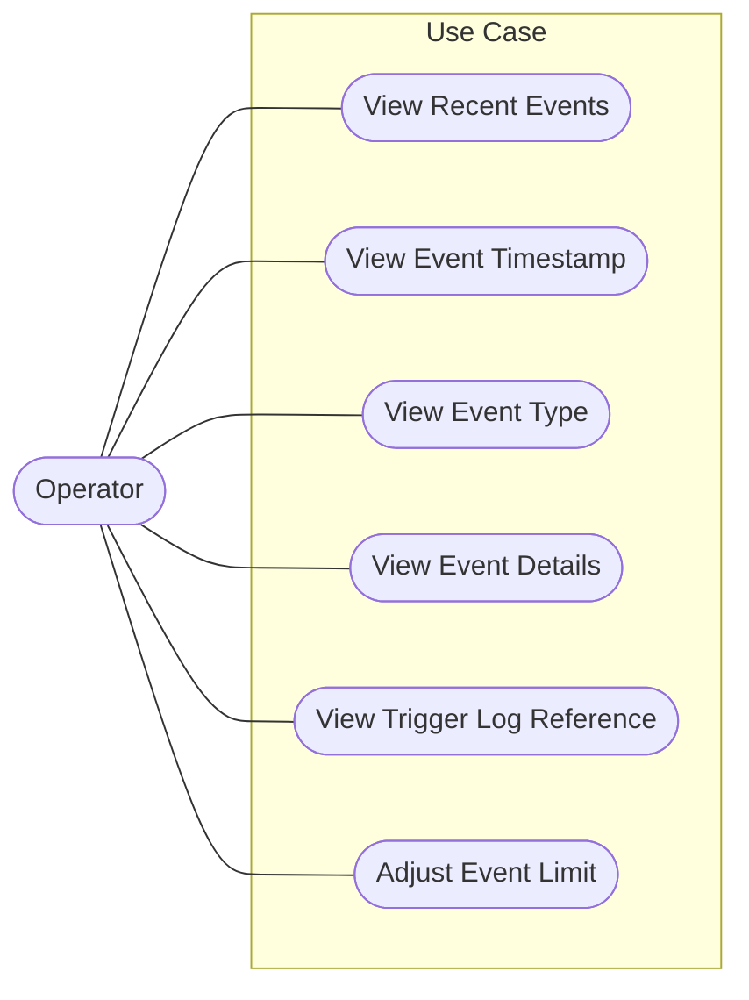
```mermaid
graph LR
    Actor1(["Operator"])

    subgraph Use Case
        direction TB
        A(["View Recent Events"])
        B(["View Event Timestamp"])
        C(["View Event Type"])
        D(["View Event Details"])
        E(["View Trigger Log Reference"])
        F(["Adjust Event Limit"])
    end

    Actor1 --- A
    Actor1 --- B
    Actor1 --- C
    Actor1 --- D
    Actor1 --- E
    Actor1 --- F
```

###### 3.1.9.2 Actors

| Actor | Type | Description |
|-------|------|-------------|
| **Operator** | Primary (Human) | The system owner who monitors telemetry, controls the station, configures parameters, and reviews events via the web dashboard or mobile application. |
| **ESP32 Firmware** | Primary (System) | The IoT gateway that collects voltage data, relays sensor readings from the Arduino, transmits telemetry to the API, and manages offline data buffering. |
| **Arduino Controller** | Secondary (System) | The low-level microcontroller that reads LDR/ultrasonic sensors and drives servo motors based on tracking algorithms or manual commands. |
| **System Timer** | Secondary (System) | Internal scheduling mechanism that triggers periodic telemetry uploads, configuration polling, and autonomous tracking cycles. |

###### 3.1.9.3 Use Case Summary

| ID | Use Case Name | Primary Actor | Related FRs |
|----|--------------|---------------|-------------|
| UC-01 | Monitor Live Telemetry | Operator | FR-23, FR-24, FR-30, FR-37 |
| UC-02 | Analyze Historical Data | Operator | FR-25, FR-28, FR-29, FR-38 |
| UC-03 | Manually Control Panel Orientation | Operator | FR-14, FR-15, FR-17, FR-31, FR-41 |
| UC-04 | Activate Emergency Stop | Operator | FR-16, FR-39 |
| UC-05 | Configure System Parameters | Operator | FR-22, FR-33, FR-34, FR-43, FR-44 |
| UC-06 | Perform Autonomous Solar Tracking | ESP32 / Arduino | FR-01 to FR-13, FR-35, FR-36 |
| UC-07 | Synchronize Offline Data | ESP32 | FR-18 to FR-21, FR-42 |
| UC-08 | Review System Events | Operator | FR-26, FR-32, FR-40 |

---

###### 3.1.9.4 Detailed Use Case Descriptions

##### UC-01: Monitor Live Telemetry

| Field | Description |
|-------|-------------|
| **Use Case ID** | UC-01 |
| **Use Case Name** | Monitor Live Telemetry |
| **Primary Actor** | Operator |
| **Secondary Actors** | Laravel API, PostgreSQL Database |
| **Description** | The operator views the current state of the solar station in real time, including sensor readings, power metrics, servo positions, and operational status. |
| **Preconditions** | (1) The web dashboard or mobile app is accessible. (2) At least one sensor log exists in the database. |
| **Postconditions** | The operator has an up-to-date view of the station's telemetry and status. |

**Main Flow:**
1. The operator opens the web dashboard (home page) or the mobile app dashboard screen.
2. The system requests the latest sensor log from `GET /api/sensor-logs/latest`.
3. The API retrieves the most recent `sensor_log` record along with its associated `power_reading`.
4. The system displays the following on the interface:
   - Light intensity values (LDR 1–6 and computed average)
   - Battery voltage and panel voltage
   - Horizontal and vertical servo angles
   - Ultrasonic distance reading
   - Operational mode (AUTO / MANUAL / IDLE)
   - Shadow detected status, movement status, and emergency stop status
5. The system continues polling at the configured interval, repeating steps 2–4.

**Alternative Flows:**
- **A1 — No Data Available:** If no sensor log exists, the system displays a "No data yet" placeholder message.
- **A2 — Stale Data Warning:** If the latest record timestamp exceeds 60 seconds, the UI displays a "Data may be stale" warning badge.

**Exception Flows:**
- **E1 — API Unreachable:** If the API request fails, the system displays a connection error notification and retries on the next polling cycle.

**Prototype:**

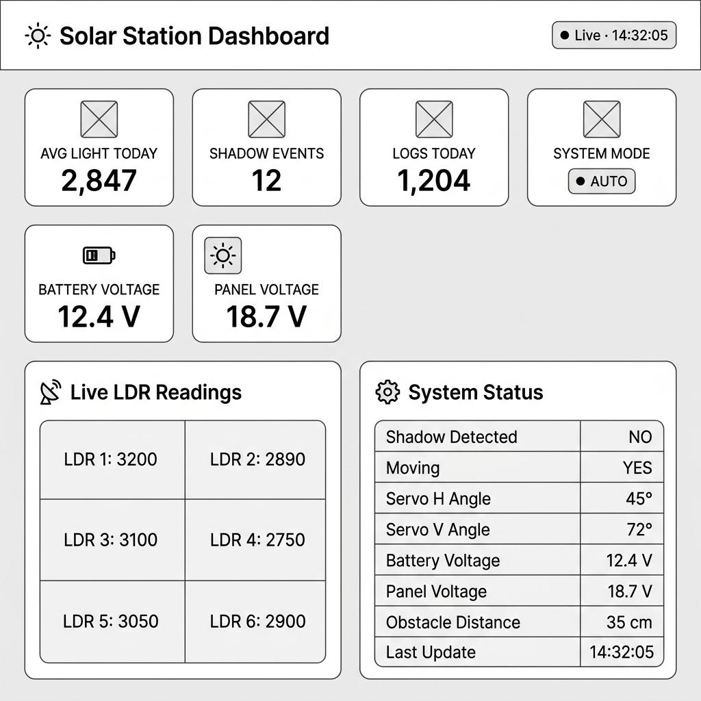
*Figure 9.0 Monitor Live Telemetry Prototype — The web dashboard displays real-time stat cards for light, shadow, logs, and system mode across the top row, followed by battery and panel voltage cards. Below, a 3×2 LDR sensor grid and a system status table provide detailed telemetry at a glance.*

---

##### UC-02: Analyze Historical Data

| Field | Description |
|-------|-------------|
| **Use Case ID** | UC-02 |
| **Use Case Name** | Analyze Historical Data |
| **Primary Actor** | Operator |
| **Secondary Actors** | Laravel API, PostgreSQL Database |
| **Description** | The operator examines historical trends and raw telemetry records to assess station performance over time. |
| **Preconditions** | (1) The web dashboard is accessible. (2) Historical sensor log data exists in the database. |
| **Postconditions** | The operator has reviewed time-series charts and/or filtered raw log data. |

**Main Flow:**
1. The operator navigates to the dashboard charts section or the sensor logs history page.
2. **Charts Path:**
   a. The operator selects a time range (15min, 30min, 1hour, 6hours, 24hours, or 7days).
   b. The system requests downsampled data from `GET /chart-data?range={selected}`.
   c. The API returns aggregated data points (avg light, shadow ratio, servo positions, power metrics).
   d. The system renders interactive time-series charts.
3. **Logs Path:**
   a. The operator navigates to the `/logs` page.
   b. The system loads the initial page of sensor log records in a table.
   c. The operator optionally applies filters (date range, shadow status, operational mode).
   d. The system re-queries with filter parameters and displays matching records.
   e. As the operator scrolls, the system loads additional pages via infinite scroll (AJAX pagination).

**Alternative Flows:**
- **A1 — No Data for Range:** If no records exist for the selected time range, the chart displays an empty state with a message.
- **A2 — Filter Yields No Results:** The logs table displays "No matching records found" with an option to clear filters.

**Prototype:**

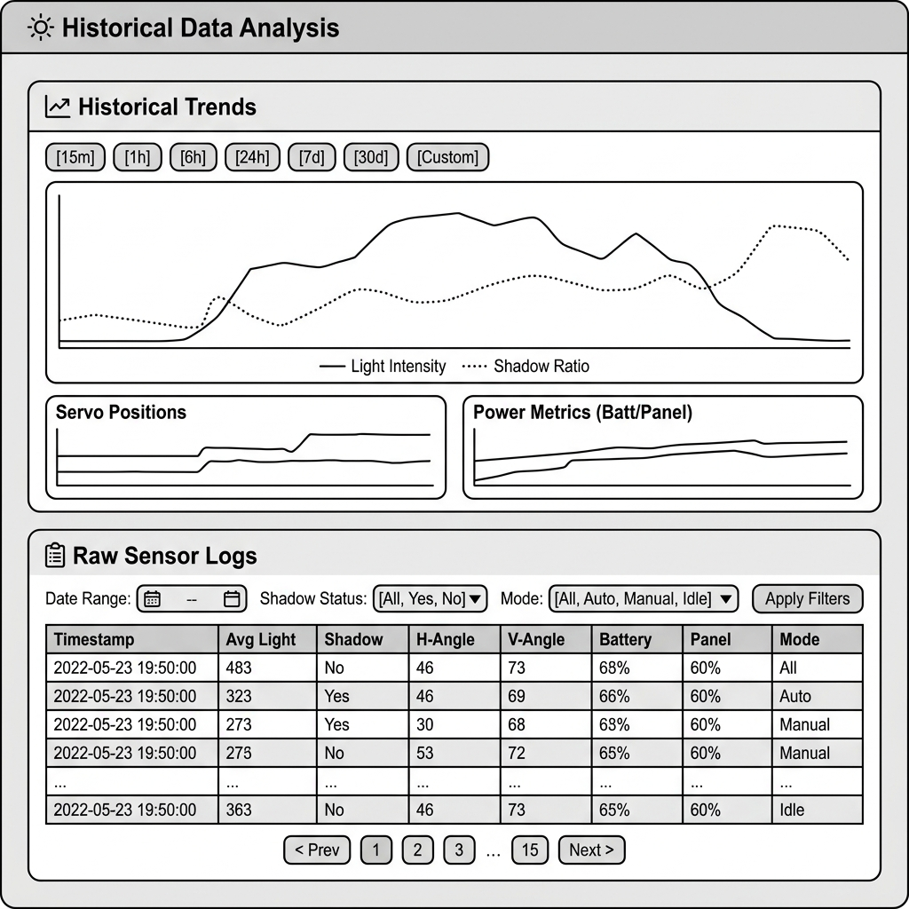
*Figure 10.0 Analyze Historical Data Prototype — The analysis screen features a large interactive chart with time-range selection (15m to 7d) and a filterable raw logs table, supporting deep-dive performance auditing.*

---

##### UC-03: Manually Control Panel Orientation

| Field | Description |
|-------|-------------|
| **Use Case ID** | UC-03 |
| **Use Case Name** | Manually Control Panel Orientation |
| **Primary Actor** | Operator |
| **Secondary Actors** | Mobile App, Laravel API, ESP32 Firmware, Arduino Controller |
| **Description** | The operator takes direct manual control of the station's panel orientation by issuing directional movement commands from the mobile application. |
| **Preconditions** | (1) The mobile app is connected to the station (via API or Bluetooth). (2) The station is operational and not in Emergency Stop state. |
| **Postconditions** | (1) The panel has moved to the operator-specified orientation. (2) The command is recorded in the `manual_commands` table. (3) The station is in MANUAL mode. |

**Main Flow:**
1. The operator opens the Controller screen on the mobile app.
2. The operator switches the station mode to MANUAL (if not already).
3. The app sends a mode change command to the API via `POST /api/manual-commands`.
4. The operator presses a directional button on the DPAD (e.g., "Move Left").
5. The app sends a command to the API: `POST /api/manual-commands {command: 'MOVE_LEFT', source: 'MOBILE'}`.
6. The API stores the command with status PENDING and returns the command ID.
7. The ESP32 polls `GET /api/manual-commands/pending` and retrieves the pending command.
8. The ESP32 forwards the command to the Arduino via serial.
9. The Arduino adjusts the horizontal servo angle accordingly.
10. The ESP32 reports command execution via `PATCH /api/manual-commands/{id} {status: 'EXECUTED'}`.
11. The app's live telemetry (UC-01) reflects the updated servo position.

**Alternative Flows:**
- **A1 — Bluetooth Control:** The operator uses Bluetooth for lower-latency control, bypassing the API. Commands are sent directly from the app to the ESP32 via BLE.
- **A2 — Precision Controls:** Instead of the DPAD, the operator uses tilt/pan sliders to set an exact servo angle.

**Exception Flows:**
- **E1 — Servo Limit Reached:** If the requested movement would exceed the angular limit, the firmware ignores the command and the system logs a warning event.
- **E2 — Emergency Stop Active:** If Emergency Stop is active, the system rejects the command and notifies the operator that the stop must be cleared first.

**Prototype:**

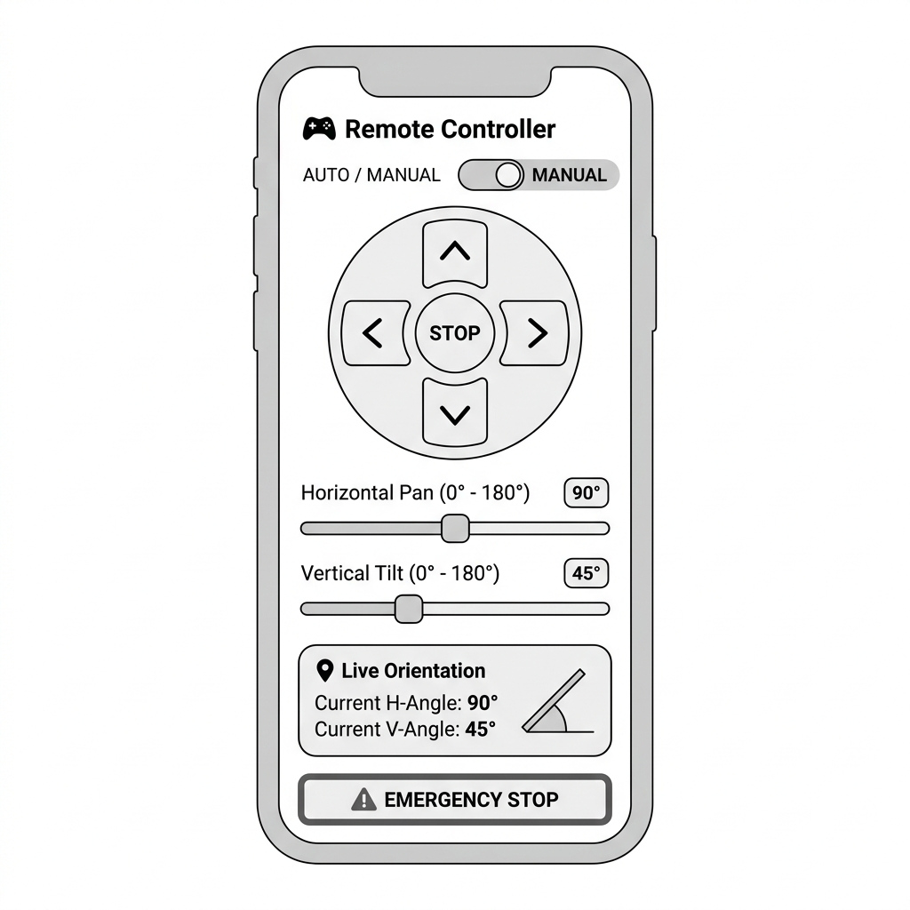
*Figure 11.0 Manual Control Prototype — The mobile application controller features a D-PAD for directional movement, precision sliders for pan/tilt adjustment, and a real-time orientation display.*

---

##### UC-04: Activate Emergency Stop

| Field | Description |
|-------|-------------|
| **Use Case ID** | UC-04 |
| **Use Case Name** | Activate Emergency Stop |
| **Primary Actor** | Operator |
| **Secondary Actors** | Mobile App, Laravel API, ESP32 Firmware, Arduino Controller |
| **Description** | The operator immediately halts all motor activity on the station for safety purposes. The system can also trigger this automatically when battery voltage drops critically low. |
| **Preconditions** | (1) The station's motors are currently active or capable of activation. (2) The operator has access to the mobile app or the system is monitoring battery voltage. |
| **Postconditions** | (1) All servo motors are stopped. (2) The station enters Emergency Stop state. (3) An emergency event is logged in `system_events`. |

**Main Flow (Manual Trigger):**
1. The operator presses the Emergency Stop button on the mobile app's Controller screen.
2. The app sends a command to the API: `POST /api/manual-commands {command: 'EMERGENCY_STOP', source: 'MOBILE'}`.
3. The API stores the command and returns acknowledgment.
4. The ESP32 receives the command on its next poll cycle.
5. The ESP32 immediately signals the Arduino to halt all servo motor PWM signals.
6. The firmware sets `emergency_stop_active = true` in subsequent telemetry uploads.
7. The ESP32 logs an event via `POST /api/system-events {event_type: 'ERROR', details: 'Emergency stop activated by operator'}`.
8. The dashboard and mobile app display the Emergency Stop status badge.

**Alternative Flows:**
- **A1 — Automatic Trigger (Low Battery):** The ESP32 reads battery voltage below 11.0V → the firmware automatically executes steps 5–8 without operator intervention, with details noting "Battery voltage critical".
- **A2 — Clear Emergency Stop:** The operator presses a "Clear Stop" button → the app sends a `CLEAR_EMERGENCY_STOP` command → the firmware resumes normal operation and sets `emergency_stop_active = false`.

**Prototype:**

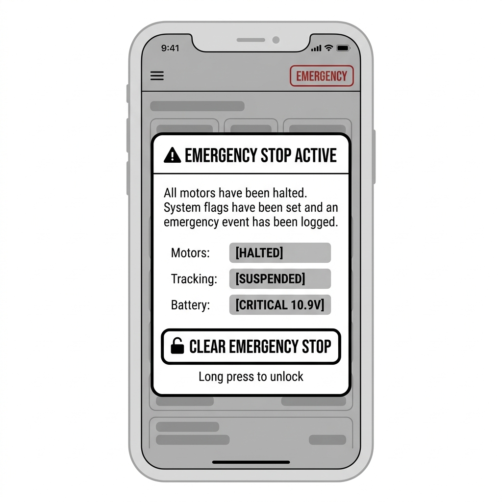
*Figure 12.0 Activate Emergency Stop Prototype — A prominent system lock overlay triggers upon emergency activation, halting all motor activity and requiring an explicit operator action to clear.*

---

##### UC-05: Configure System Parameters

| Field | Description |
|-------|-------------|
| **Use Case ID** | UC-05 |
| **Use Case Name** | Configure System Parameters |
| **Primary Actor** | Operator |
| **Secondary Actors** | Mobile App, Laravel API, ESP32 Firmware |
| **Description** | The operator adjusts the station's operational parameters (thresholds, home positions, speeds, intervals) remotely through the mobile application. |
| **Preconditions** | (1) The mobile app is connected to the API. (2) The operator has access to the Settings screen. |
| **Postconditions** | (1) A new `system_configs` record is created in the database. (2) The ESP32 fetches and applies the new configuration on its next polling cycle. |

**Main Flow:**
1. The operator navigates to the Settings screen on the mobile app.
2. The app fetches the current configuration from `GET /api/system-configs/latest`.
3. The app displays the current values in editable form fields:
   - Shadow threshold
   - Servo home positions (horizontal, vertical)
   - Ultrasonic scan angle range (min, max)
   - Obstacle distance threshold
   - Motor speed
   - Upload interval (seconds)
4. The operator modifies one or more parameter values.
5. The operator presses "Save Configuration".
6. The app submits the updated configuration via `POST /api/system-configs`.
7. The API creates a new configuration record and returns it with a new `config_id`.
8. On the ESP32's next configuration poll, it fetches the new config from `GET /api/system-configs/latest`.
9. The ESP32 applies the new parameters to its tracking algorithms and upload behavior.
10. Subsequent sensor logs reference the new `config_id`.

**Alternative Flows:**
- **A1 — ESP32 Offline:** If the ESP32 cannot reach the API, it continues operating with the last known configuration. The new config will be applied when connectivity is restored.

**Exception Flows:**
- **E1 — Invalid Values:** If the operator enters values outside acceptable ranges, the app displays a validation error and prevents submission.

**Prototype:**

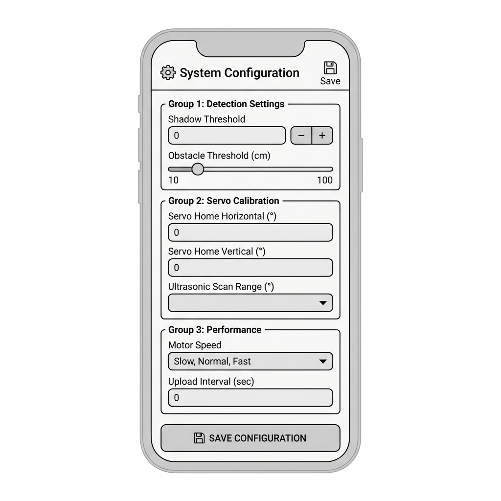
*Figure 13.0 System Configuration Prototype — A grouped settings form allows the operator to calibrate thresholds, servo limits, and upload behaviors remotely via the mobile app.*

---

##### UC-06: Perform Autonomous Solar Tracking

| Field | Description |
|-------|-------------|
| **Use Case ID** | UC-06 |
| **Use Case Name** | Perform Autonomous Solar Tracking |
| **Primary Actor** | ESP32 Firmware / Arduino Controller |
| **Secondary Actors** | System Timer, LDR Sensors, Ultrasonic Sensor, Servo Motors |
| **Description** | The station autonomously orients the solar panel toward the direction of maximum light intensity while avoiding physical obstacles. This is the core operational loop of the system. |
| **Preconditions** | (1) The station is powered on. (2) The system is in AUTO mode. (3) Emergency Stop is not active. |
| **Postconditions** | (1) The panel is oriented toward the brightest light source. (2) Telemetry data has been recorded. (3) Any obstacles have been avoided. |

**Main Flow:**
1. The System Timer triggers a tracking cycle at the configured polling interval.
2. The Arduino reads analog values from all six LDR sensors.
3. The Arduino computes the light differential between sensor pairs:
   - Left vs. Right (horizontal axis)
   - Top vs. Bottom (vertical axis)
4. If the differential exceeds the configured `shadow_threshold`:
   a. The Arduino adjusts the horizontal servo angle toward the brighter side.
   b. The Arduino adjusts the vertical servo angle toward the brighter side.
   c. Servo movements are clamped to configured angular limits.
5. The Arduino reads the ultrasonic sensor distance.
6. If an obstacle is detected within `obstacle_distance_threshold`:
   a. The Arduino executes an avoidance sequence (see Alternative Flow A1).
7. The Arduino transmits sensor readings to the ESP32 via serial.
8. The ESP32 reads battery and panel voltages from voltage dividers.
9. The ESP32 posts the combined telemetry to `POST /api/sensor-logs`.
10. The ESP32 posts the power reading to `POST /api/power-readings` with the returned `log_id`.
11. The cycle repeats from step 1.

**Alternative Flows:**
- **A1 — Obstacle Avoidance Sequence:** The ultrasonic mounting servo scans the configured arc → the system identifies a clear path → servos reposition to avoid the obstacle → an event is logged via `POST /api/system-events {event_type: 'WARN', details: 'Obstacle detected'}`.
- **A2 — Shadow Detected:** If all LDR sensors read below threshold simultaneously, the system logs a shadow event and holds the current position until light conditions improve.
- **A3 — IDLE Mode Entry:** If the system transitions to IDLE, servos return to home positions; telemetry collection continues but tracking stops.

**Exception Flows:**
- **E1 — Low Battery:** Battery voltage < 11.0V triggers UC-04 (Emergency Stop) automatically.
- **E2 — Servo Mechanical Failure:** If servo feedback indicates a stall, the system logs an ERROR event and enters IDLE.

**Prototype:**

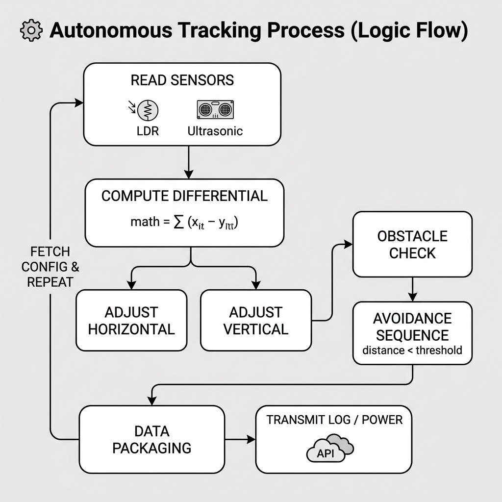
*Figure 14.0 Autonomous Tracking Logic Prototype — A technical process flow illustrating the sensor reading, light differential computation, and motor adjustment loop.*

---

##### UC-07: Synchronize Offline Data

| Field | Description |
|-------|-------------|
| **Use Case ID** | UC-07 |
| **Use Case Name** | Synchronize Offline Data |
| **Primary Actor** | ESP32 Firmware |
| **Secondary Actors** | System Timer, Laravel API, SPIFFS Storage |
| **Description** | When the station loses network connectivity, telemetry data is buffered locally on the ESP32's SPIFFS file system. Upon reconnection, all buffered data is uploaded to the API and the sync status is reported. |
| **Preconditions** | (1) The ESP32 has telemetry data to transmit. (2) Network connectivity has been lost and subsequently restored (or is currently unavailable for buffering). |
| **Postconditions** | (1) All buffered telemetry data has been uploaded to the database. (2) An `upload_statuses` record reflects the sync result. (3) Local SPIFFS storage is freed. |

**Main Flow (Buffering — Offline):**
1. The ESP32 attempts to POST telemetry to the API.
2. The HTTP request fails (timeout or connection refused).
3. The ESP32 serializes the telemetry payload to a JSON file on SPIFFS.
4. The ESP32 increments the local pending file counter.
5. The firmware continues sensor data collection (UC-06) using the last known configuration.

**Main Flow (Synchronization — Online):**
6. The ESP32 detects network restoration (successful HTTP response or Wi-Fi reconnect event).
7. The ESP32 enumerates all pending JSON files on SPIFFS.
8. For each buffered file (oldest first):
   a. The ESP32 reads the file contents.
   b. The ESP32 posts the data to `POST /api/sensor-logs` and `POST /api/power-readings`.
   c. Upon successful API response (201), the ESP32 deletes the local file.
   d. Upon failure, the file is retained for the next sync attempt.
9. After processing all files, the ESP32 reports the sync result via `POST /api/upload-statuses`:
   - `files_uploaded`: count of successfully synced files
   - `files_pending`: count of remaining files (if any)
   - `storage_used_kb`: current SPIFFS usage
   - `upload_success`: true if all files were synced
10. Normal real-time upload resumes.

**Exception Flows:**
- **E1 — SPIFFS Full:** If local storage is exhausted, the ESP32 logs an ERROR event and begins overwriting the oldest buffered files.
- **E2 — Partial Sync Failure:** If some files fail during sync, the ESP32 reports `upload_success: false` and retries on the next cycle.

**Prototype:**

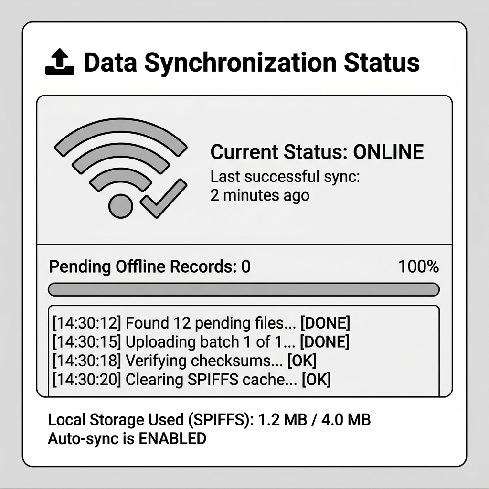
*Figure 15.0 Offline Sync Prototype — The dashboard's synchronization status panel tracks pending records, local SPIFFS storage health, and real-time connectivity states.*

---

##### UC-08: Review System Events

| Field | Description |
|-------|-------------|
| **Use Case ID** | UC-08 |
| **Use Case Name** | Review System Events |
| **Primary Actor** | Operator |
| **Secondary Actors** | Laravel API, PostgreSQL Database |
| **Description** | The operator reviews a chronological log of system events to audit station behavior, diagnose errors, and verify mode changes. |
| **Preconditions** | (1) The web dashboard or mobile app is accessible. (2) System events exist in the database. |
| **Postconditions** | The operator has reviewed the event history and identified any issues requiring attention. |

**Main Flow:**
1. The operator navigates to the System Events section of the web dashboard or the Events screen on the mobile app.
2. The system requests recent events from `GET /api/system-events/recent?limit=20`.
3. The API retrieves the most recent events ordered by timestamp (descending).
4. The system displays each event in a list/table showing:
   - Timestamp
   - Event type (ERROR, WARN, INFO) with color-coded badges
   - Detailed description
   - Reference to the triggering sensor log (if available)
5. The operator reviews the events to identify patterns, errors, or anomalies.

**Alternative Flows:**
- **A1 — Increased Limit:** The operator requests more events by adjusting the limit parameter (up to 100).
- **A2 — No Events:** If no system events exist, the interface displays an "All clear — no events recorded" message.

**Prototype:**

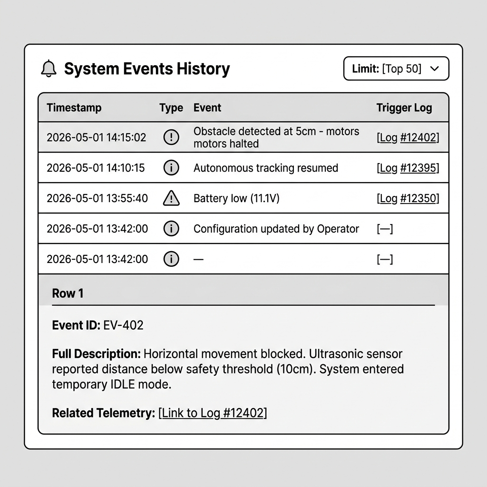
*Figure 16.0 System Events Prototype — A chronological list of system logs featuring event type categorization (ERROR/WARN/INFO) and direct links to triggering telemetry data.*

---

#### 3.2 Non-Functional Requirements

##### 3.2.1 Performance Requirements

| ID | Requirement |
|----|------------|
| NFR-01 | The API shall respond to GET requests within 500 milliseconds under normal load. |
| NFR-02 | The ESP32 shall transmit telemetry data at the interval defined by `upload_interval_sec` (default: 10 seconds). |
| NFR-03 | The web dashboard chart data endpoint shall support downsampling to a configurable number of data points (default: 60) to maintain rendering performance. |
| NFR-04 | The mobile application shall poll for live data updates at a user-configurable interval (minimum: 3 seconds). |
| NFR-05 | The sensor logs page shall load the initial page within 2 seconds and support infinite scroll without full page reloads. |

##### 3.2.2 Safety Requirements

| ID | Requirement |
|----|------------|
| NFR-06 | The system shall enforce servo angular limits in firmware to prevent mechanical overextension. |
| NFR-07 | The Emergency Stop feature shall override all motor commands and halt movement within 100 milliseconds of activation. |
| NFR-08 | The system shall automatically enter Emergency Stop when battery voltage drops below 11.0V. |
| NFR-09 | Obstacle detection shall trigger an avoidance sequence before any collision can occur. |

##### 3.2.3 Reliability Requirements

| ID | Requirement |
|----|------------|
| NFR-10 | The ESP32 firmware shall operate continuously without requiring manual restart under normal conditions. |
| NFR-11 | The offline data buffering system shall preserve telemetry data during network outages of up to 24 hours (limited by SPIFFS capacity). |
| NFR-12 | The database shall maintain referential integrity between `sensor_logs`, `power_readings`, `manual_commands`, and `system_events` tables. |
| NFR-13 | The system shall log all critical failures as system events for post-incident analysis. |

##### 3.2.4 Availability Requirements

| ID | Requirement |
|----|------------|
| NFR-14 | The web dashboard shall be available 99% of the time during operating hours, served via Docker/Nginx. |
| NFR-15 | The firmware shall continue autonomous tracking operations independently of server availability. |
| NFR-16 | The mobile application shall provide Bluetooth-based control even when Wi-Fi/API connectivity is lost. |

##### 3.2.5 Maintainability Requirements

| ID | Requirement |
|----|------------|
| NFR-17 | The backend shall follow the Repository-Service pattern to decouple data access from business logic. |
| NFR-18 | The firmware shall use a Gateway-Controller pattern separating communication (ESP32) from sensor/motor logic (Arduino). |
| NFR-19 | Database schema changes shall be managed via Laravel migrations for version-controlled evolution. |

##### 3.2.6 Portability Requirements

| ID | Requirement |
|----|------------|
| NFR-20 | The web dashboard shall be containerized using Docker for consistent deployment across environments. |
| NFR-21 | The mobile application shall be built with Expo for cross-platform compatibility (Android primary). |

---

### 4. External Interface Requirements

#### 4.1 User Interfaces

##### 4.1.1 Web Dashboard (Laravel Blade)
- **Overview Panel:** Displays real-time gauges for battery voltage, panel voltage, average light intensity, and current servo angles.
- **Status Badges:** Color-coded indicators for operational mode (AUTO/MANUAL/IDLE), shadow detection, movement status, and emergency stop.
- **Charts Section:** Interactive time-series charts with selectable ranges (15min to 7days) showing light intensity trends, shadow ratio, servo positions, and power metrics.
- **System Events Table:** Chronological list of recent events with type categorization (ERROR, WARN, INFO).
- **Upload Status Panel:** Displays the five most recent synchronization attempts with success/failure indicators.
- **Sensor Logs Page:** Full-width tabular view with infinite scroll, supporting filters by date range, shadow status, and mode.

##### 4.1.2 Android Application (React Native)
- **Dashboard Screen:** Summary cards showing latest readings and system health.
- **Controller Screen:** Interactive DPAD for directional movement, precision sliders for tilt/pan, mode toggle (AUTO/MANUAL/IDLE), and Emergency Stop button.
- **Events Screen:** Scrollable notification log with category filters.
- **Settings Screen:** Form-based configuration for API endpoint, polling interval, shadow threshold, servo home positions, motor speed, and ultrasonic scan parameters.

#### 4.2 Hardware Interfaces

| Interface | Protocol | Description |
|-----------|----------|-------------|
| ESP32 ↔ Arduino Uno | Serial (UART) | Bidirectional communication for sensor data and motor commands at 9600 baud |
| Arduino ↔ LDR Sensors (×6) | Analog (ADC) | 12-bit analog readings (0–4095) via analog input pins |
| Arduino ↔ Ultrasonic (HC-SR04) | Digital (GPIO) | Trigger/Echo pulse-based distance measurement |
| Arduino ↔ Servos (×3) | PWM | Positional control for horizontal, vertical, and ultrasonic mounting servos |
| ESP32 ↔ Voltage Dividers | Analog (ADC) | Battery and panel voltage measurement via resistor divider networks |
| ESP32 ↔ OLED Display | I2C | 128×64 pixel local status display |
| ESP32 ↔ Mobile App | Bluetooth (BLE) | Short-range manual control commands |

#### 4.3 Software Interfaces

| Interface | Type | Description |
|-----------|------|-------------|
| Laravel REST API | HTTP/JSON | RESTful endpoints for telemetry ingestion, data retrieval, and configuration management |
| Supabase PostgreSQL | TCP/SQL | Cloud database connection for persistent data storage |
| SQLite (Dev) | File | Local development database for the Laravel application |
| Expo Dev Server | HTTP | Development server for React Native mobile application |

#### 4.4 Communication Interfaces

| Protocol | Usage | Details |
|----------|-------|---------|
| HTTP/HTTPS | ESP32 → API, App → API, Web → API | RESTful JSON payloads over local network |
| Bluetooth LE | Mobile App → ESP32 | Direct manual control commands bypassing the server |
| Wi-Fi (802.11 b/g/n) | ESP32 network connectivity | 2.4 GHz band; connects to local access point |
| Serial (UART) | ESP32 → Arduino | Wired communication at 9600 baud |
| I2C | ESP32 → OLED | Wired display communication on address 0x3C |

---

### 5. Data Requirements

#### 5.1 Logical Data Model

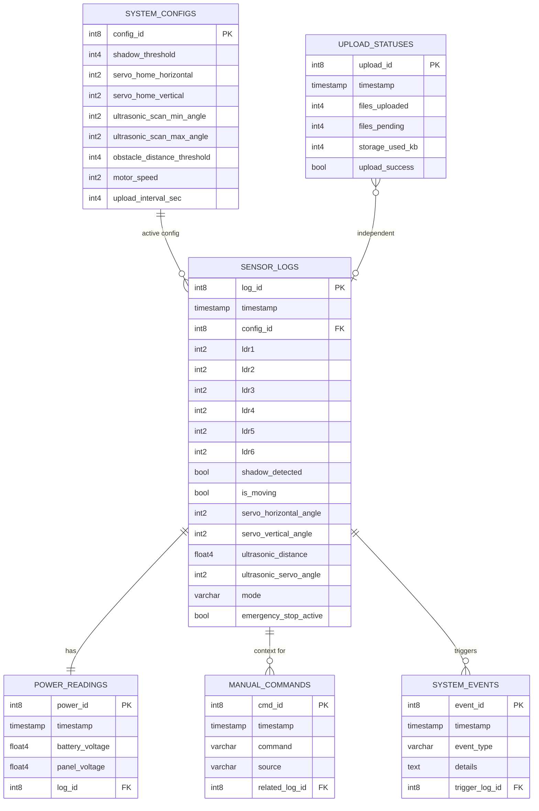
```mermaid
erDiagram
    SYSTEM_CONFIGS ||--o{ SENSOR_LOGS : "active config"
    SENSOR_LOGS ||--|| POWER_READINGS : "has"
    SENSOR_LOGS ||--o{ MANUAL_COMMANDS : "context for"
    SENSOR_LOGS ||--o{ SYSTEM_EVENTS : "triggers"
    UPLOAD_STATUSES }o--o| SENSOR_LOGS : "independent"

    SYSTEM_CONFIGS {
        int8 config_id PK
        int4 shadow_threshold
        int2 servo_home_horizontal
        int2 servo_home_vertical
        int2 ultrasonic_scan_min_angle
        int2 ultrasonic_scan_max_angle
        int4 obstacle_distance_threshold
        int2 motor_speed
        int4 upload_interval_sec
    }

    SENSOR_LOGS {
        int8 log_id PK
        timestamp timestamp
        int8 config_id FK
        int2 ldr1
        int2 ldr2
        int2 ldr3
        int2 ldr4
        int2 ldr5
        int2 ldr6
        bool shadow_detected
        bool is_moving
        int2 servo_horizontal_angle
        int2 servo_vertical_angle
        float4 ultrasonic_distance
        int2 ultrasonic_servo_angle
        varchar mode
        bool emergency_stop_active
    }

    POWER_READINGS {
        int8 power_id PK
        timestamp timestamp
        float4 battery_voltage
        float4 panel_voltage
        int8 log_id FK
    }

    MANUAL_COMMANDS {
        int8 cmd_id PK
        timestamp timestamp
        varchar command
        varchar source
        int8 related_log_id FK
    }

    SYSTEM_EVENTS {
        int8 event_id PK
        timestamp timestamp
        varchar event_type
        text details
        int8 trigger_log_id FK
    }

    UPLOAD_STATUSES {
        int8 upload_id PK
        timestamp timestamp
        int4 files_uploaded
        int4 files_pending
        int4 storage_used_kb
        bool upload_success
    }
```

#### 5.2 Data Dictionary

Refer to **Section 4 (Data Design)** of the Software Design Description (SDD) for the complete field-level data dictionary including data types, constraints, and descriptions for all six tables.

#### 5.3 Data Relationships
- **sensor_logs ↔ power_readings (1:1):** Each sensor log has exactly one associated power reading, separating environmental telemetry from hardware health metrics.
- **sensor_logs ↔ system_configs (N:1):** Multiple log entries reference a single active configuration, enabling historical traceability of calibration settings.
- **sensor_logs ↔ manual_commands (1:N):** Commands are linked to the sensor log that was active at the time of execution for contextual debugging.
- **sensor_logs ↔ system_events (1:N):** Events are linked to the triggering sensor log entry for precise root-cause analysis.
- **upload_statuses (Independent):** Intentionally decoupled from telemetry tables to monitor synchronization pipeline health without creating tight coupling to data schemas.

---

### 6. System Modes of Operation

#### 6.1 AUTO Mode
The default operational mode. The station autonomously tracks the sun by comparing LDR sensor pair readings and adjusting servo positions. Obstacle avoidance is active. Telemetry is transmitted at the configured upload interval.

#### 6.2 MANUAL Mode
Activated by the operator via the mobile application. Autonomous tracking is suspended. The operator controls panel orientation through directional commands (DPAD or precision controls) sent via Bluetooth or API. Telemetry collection continues.

#### 6.3 IDLE Mode
The station returns servos to their configured home positions and ceases tracking. Sensor data collection and telemetry transmission continue for monitoring purposes. This mode is used during maintenance or non-operational periods.

#### 6.4 Emergency Stop State
Triggered by the operator (via the mobile app's Emergency Stop button) or automatically when battery voltage drops below 11.0V. All motor activity is immediately halted. The system logs an emergency event and remains in this state until manually cleared by the operator.

---

### 7. Appendices

#### Appendix A: API Endpoint Summary

| Method | Endpoint | Description |
|--------|----------|-------------|
| GET | `/api/sensor-logs/latest` | Retrieve the most recent sensor log with power reading |
| GET | `/api/sensor-logs` | Retrieve paginated sensor log history |
| POST | `/api/sensor-logs` | Submit a new sensor log entry |
| GET | `/api/power-readings/latest` | Retrieve the most recent power reading |
| POST | `/api/power-readings` | Submit a new power reading |
| GET | `/api/system-events/recent` | Retrieve recent system events (limit configurable) |
| POST | `/api/system-events` | Submit a new system event |
| POST | `/api/manual-commands` | Submit a new manual command |
| POST | `/api/upload-statuses` | Submit a new upload status record |
| GET | `/api/system-configs/latest` | Retrieve the latest system configuration |
| POST | `/api/system-configs` | Submit a new system configuration |
| GET | `/chart-data` | Retrieve downsampled chart data for dashboard |
| GET | `/logs` | Retrieve filtered/paginated sensor logs (Web UI) |

#### Appendix B: Hardware Component List

| Component | Model | Quantity | Role |
|-----------|-------|----------|------|
| Microcontroller (Gateway) | ESP32 WROOM-32 | 1 | Wi-Fi/BLE connectivity, voltage sensing, OLED display |
| Microcontroller (Controller) | Arduino Uno | 1 | Sensor reading, servo motor control |
| Light Sensors | LDR (Photoresistor) | 6 | Light intensity measurement for sun tracking |
| Distance Sensor | HC-SR04 Ultrasonic | 1 | Obstacle detection and avoidance |
| Servo Motors | MG996R | 3 | Horizontal axis, vertical axis, ultrasonic mount |
| Display | SSD1306 OLED 128×64 | 1 | Local station status display |
| Power Monitoring | Resistor Voltage Dividers | 2 | Battery and panel voltage measurement |

#### Appendix C: Traceability Matrix

| Functional Requirement | SDD Section | SPMP Phase |
|----------------------|-------------|------------|
| FR-01 to FR-05 (Telemetry Acquisition) | §3.1 Component Architecture | Phase 1: Hardware Integration |
| FR-06 to FR-10 (Autonomous Tracking) | §5.1 Telemetry Polling Sequence | Phase 1: Hardware Integration |
| FR-11 to FR-13 (Obstacle Avoidance) | §3.1 Component Architecture | Phase 1: Hardware Integration |
| FR-14 to FR-17 (Manual Control) | §5.2 Manual Command Flow | Phase 2: IoT Connectivity |
| FR-18 to FR-22 (Data Sync) | §5.1 Telemetry Polling Sequence | Phase 2: IoT Connectivity |
| FR-23 to FR-29 (Web Dashboard) | §6.1 Web Dashboard | Phase 4: Mobile/Web UI |
| FR-30 to FR-34 (Mobile App) | §6.2 Android Application | Phase 4: Mobile/Web UI |
| FR-35 to FR-45 (API Management) | §4.1 Data Description | Phase 3: Backend Development |
